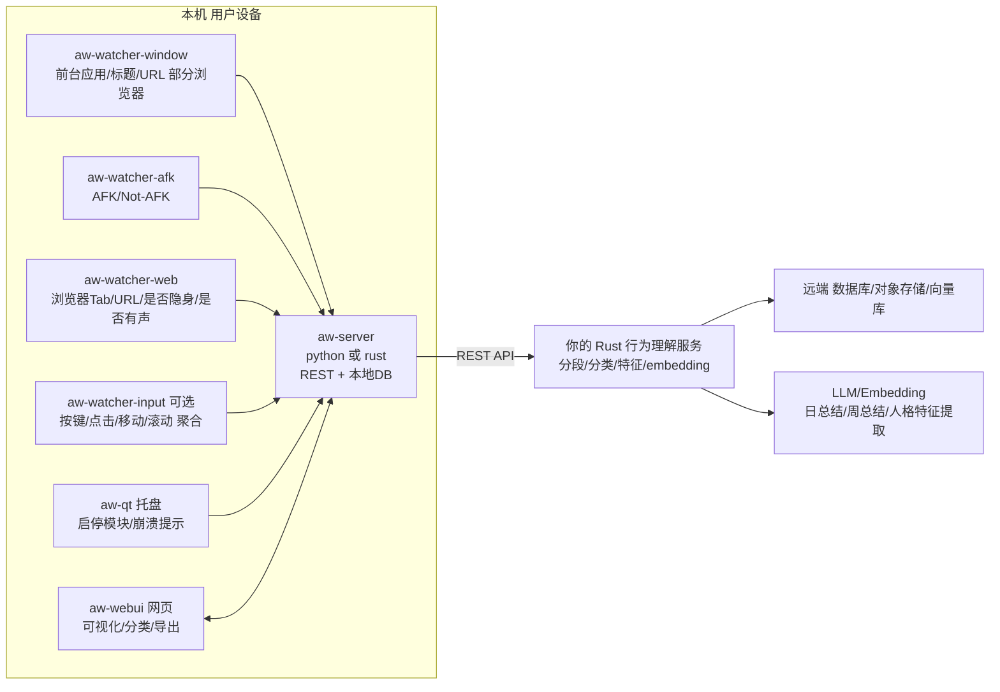
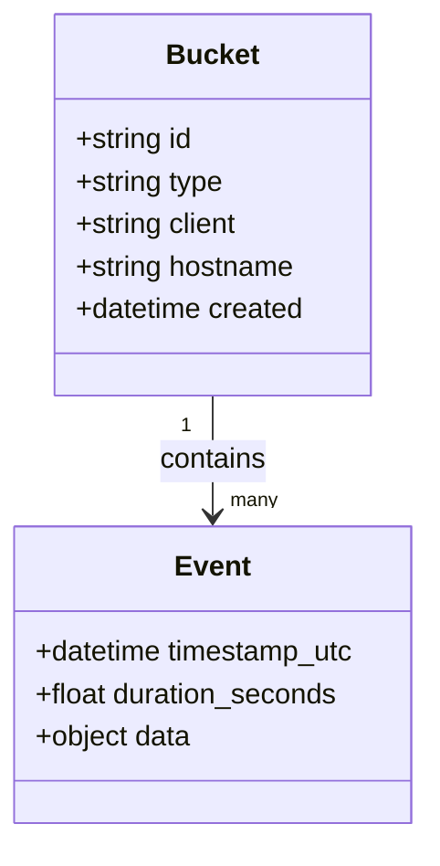
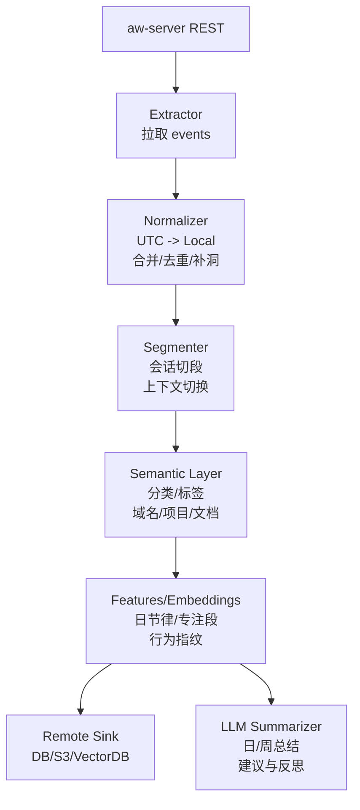
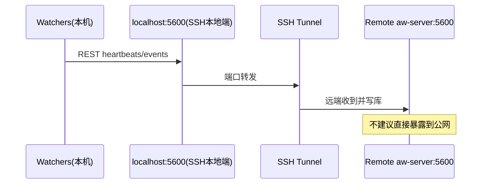

# ActivityWatch：面向“用户行为建模 / 桌面理解”的系统化说明

> 目标：把 ActivityWatch 当作你的“桌面行为传感器 + 时序数据库”。它负责**可靠采集与存储**，你负责在 Rust 后端里做**语义化、建模、总结与（可选）触发**。

这份笔记围绕你关心的：**获取用户行为**（时序、点击/输入强度、是否在电脑前、正在使用什么程序、双屏情况下的解释）、以及**Rust 后端 + Web 前端 + 远程汇总**怎么搭起来。

---

## 0. 一句话先定性：ActivityWatch 能“理解”到什么程度？

- ActivityWatch 默认更像“桌面版埋点系统”：记录**前台窗口/应用**、**AFK（离开键盘）**、以及（装扩展后）**浏览器 Tab/URL** 等。
- 它本身不做“人类语义理解”（不会告诉你“用户在写周报/在做报税”），但它把**可推断语义的线索**结构化了：`app/title/url/project/language + duration + timestamp`。
- 所以你的建模系统通常是两层：
  1) ActivityWatch：采集与存储（可追溯、可导出）
  2) 你的理解层（Rust/LLM/Embedding）：分段、分类、聚合、解释

---

## 1. 核心组件与数据流（你需要理解的“全局架构”）

ActivityWatch 的组件可以理解为四类：

- **Watchers（采集端）**：例如 `aw-watcher-window`（前台窗口）、`aw-watcher-afk`（空闲）、`aw-watcher-web`（浏览器扩展）、可选的 `aw-watcher-input`（键鼠强度）等。
- **Server（存储 + REST API）**：`aw-server-python`（旧）与 `aw-server-rust`（新/推荐）。
- **UI（前端）**：`aw-webui`（网页）用于浏览、导出、配置分类；`aw-qt`（托盘）用于启停模块。
- **你自己的后端（理解层）**：从 REST API 拉事件，做语义化、建模、同步到远端。



你可以把 AW 看成：**“时间轴上的观测（observations）”**，而不是“动作（actions）”。

---

## 2. 数据模型：Bucket / Event / Heartbeat（为什么它适合做时序行为建模）

ActivityWatch 的数据模型非常规整：

- **Bucket**：同一类来源的事件集合（建议“一台机器 + 一个 watcher = 一个 bucket”）。
- **Event**：有 `timestamp` 和 `duration` 的时间段事件，`data` 存结构化字段。
- **Heartbeat**：watcher 不是持续写 event，而是周期性上报 heartbeat；server 会把“相邻且 data 相同”的 heartbeat 合并成更长的 event（省空间，也更好做时序分析）。



常见 event type（理解“它到底记录了什么”）：

- `currentwindow`: `{ app: string, title: string }`
- `afkstatus`: `{ status: "afk" | "not-afk" }`
- `web.tab.current`: `{ url: string, title: string, audible: bool, incognito: bool }`
- `app.editor.activity`: `{ file: string, project: string, language: string }`
- `os.hid.input`（启用 `aw-watcher-input` 才会有）: `{ presses: int, clicks: int, deltaX: int, deltaY: int, scrollX: int, scrollY: int }`

注意点（做跨天建模时很关键）：

- **所有时间戳以 UTC 存储**，本地时区偏移会被丢弃。你在后端做“按天统计”时要自己按用户时区切分。
- Bucket 维度上通常会带 `hostname`，这对“多机汇总/迁移/同步”很重要（但某些 watcher/扩展历史上可能 hostname 不完善，需要留意）。
- 数据通常存储在数据目录中的 **SQLite 数据库**（建议通过 REST API 导出/查询，不要强依赖底层 DB 结构）。
- 你可能会看到 `duration = 0` 的事件：这通常是 heartbeat 合并机制导致“暂时无法确定真实持续时间”，需要在分析阶段做补全（例如用 next-event 的时间边界做 flooding/填充）。
- 如果 server 暂时不可用，支持 heartbeat 队列的 watcher 会先把数据排队，等 server 恢复再补写（行为建模里把“延迟写入”当成常态更稳）。

---

## 3. 你能获取哪些“用户行为信号”？（按你关心的维度梳理）

### 3.1 时序（Time series）：用户做事的“时间轴”

这是 AW 的强项：你得到的是连续可切片的时间轴。

你可以直接回答：

- 今天总共用电脑多久？（`not-afk` 与 `afk` 的交集/差集）
- 每个应用用了多久？（`currentwindow` 的 `app` 聚合）
- “连续专注段”有哪些？（窗口切换少、且 not-afk 持续的时间段）
- 上下文切换频率如何？（窗口事件切换次数/小时）

### 3.2 点击/键鼠行为（Input intensity）：不是“记录内容”，而是“强度”

ActivityWatch **默认不记录每次点击**，也不记录按键内容（隐私友好）。

如果你想要“强度信号”，可以启用可选模块（新版本里通常随 ActivityWatch 一起发布，但不一定默认开启）：

- `aw-watcher-input`：记录**按键次数、鼠标点击次数、鼠标移动量、滚动量**等聚合信号（常用于区分“在发呆/在读/在高强度输入”）。
  - event type 常见为 `os.hid.input`
  - 字段（一个采样周期的聚合）：`presses`、`clicks`、`deltaX`、`deltaY`、`scrollX`、`scrollY`

建模建议：

- 强度信号非常适合做“状态”特征（专注/走神/看视频/开会），但不适合做“精确动作序列”（你那部分可以交给 ShowUI/Aloha 一类）。

### 3.3 是否在电脑前（Presence）：用 AFK 推断，但要理解它的语义

`aw-watcher-afk` 的本质是：**多久没键鼠输入**。

- `not-afk` 更接近：“手在键盘/鼠标附近并有交互”
- `afk` 更接近：“一段时间没键鼠交互”

它不等价于“人离开屏幕”——比如读文档/看视频/电话会议，你可能长时间无输入，但人其实在电脑前。

实用增强（仍然围绕行为建模）：

- 把 `afk` 的 `timeout` 设得更贴合你：例如 3 分钟适合“键鼠工作”；10 分钟更适合“阅读/思考多”的人。
- 叠加 `aw-watcher-input`（强度）+ `aw-watcher-media-player`（是否在播放媒体）能显著提高“人在不在电脑前”的解释能力。
- 如果你启用了浏览器 watcher：`web.tab.current.audible = true` 可作为“人在场但不动键鼠”的强信号；新版本还有可选的 *audible-as-active* 能把这段时间计为 active（适合视频/会议/旁听）。
- 对“会议/旁听”这类长时间无输入，建议在后端做一种状态：`passive_active`（窗口在会议软件/视频站点，且音频在播，即使键鼠少也算“在场”）。

### 3.4 如何判断“正在使用什么程序”（尤其双屏）

核心事实：`aw-watcher-window` 记录的是**前台/聚焦窗口（foreground window）**。

这意味着：

- 单屏/多屏都一样：系统只有一个“前台窗口”，所以 AW 在同一时间段只会给你一个 `app/title`。
- 双屏典型场景：
  - A 屏播放视频（你不点它）
  - B 屏写代码（你一直在敲）
  - AW 只会认为你在“写代码”（因为前台在 IDE）

如何补偿双屏的“并行上下文”：

- **媒体侧信号**：启用 `aw-watcher-media-player` / `aw-watcher-spotify` 等，从系统媒体接口记录“正在播放什么”。它能补上“后台播放/第二屏播放”的信息。
- **浏览器侧信号**：`aw-watcher-web` 只记录“当前 active tab”，不会记录后台 tab。但“看视频时经常 active tab 就是视频页”，仍然有帮助。
- **你的理解层策略**：把“媒体播放”作为一个独立通道，与“前台窗口”并行建模（两条时间轴），不要强行塞进同一个 `currentwindow`。

如果你还想回答“用户当下主要在看哪块屏幕/鼠标在哪块屏幕”：ActivityWatch 默认不记录 monitor 信息。常见做法是：

- 自定义一个 watcher 记录**鼠标绝对坐标**（再映射到屏幕编号）
- 或低频**截屏/截图**做理解（信息量大但隐私成本最高）

### 3.5 Watcher 信号全景表（围绕“行为建模”挑你最需要的）

| 你要的信号 | 典型 watcher | 你会拿到什么（直觉版） | 对建模最常见的用法 | 隐私风险 |
| --- | --- | --- | --- | --- |
| 应用/窗口使用 | `aw-watcher-window` | `app/title`（浏览器里通常是 Tab 标题） | 应用分布、上下文切换、专注段 | 中（title 可能敏感） |
| Wayland 下窗口 | `aw-watcher-window-wayland` | 同上（Wayland 兼容实现） | Linux Wayland 环境下补齐窗口信号 | 中 |
| 是否离开键盘 | `aw-watcher-afk` | `afk/not-afk` 段 | “人在不在”近似、有效用机时长 | 低 |
| 浏览器语义 | `aw-watcher-web`（扩展） | `url/title/audible/incognito` | 域名级行为画像、内容侧上下文 | 高（URL 可能敏感） |
| 编辑器/代码语义 | `aw-watcher-vscode` / `vim` / `emacs` | `file/project/language` | 项目画像、语言/文件类型分布 | 中到高（文件路径） |
| 输入/点击强度 | `aw-watcher-input` | `presses/clicks/delta/scroll` | 状态识别（高输入/低输入/离开） | 低（不含内容） |
| 媒体播放补充 | `aw-watcher-media-player` / `spotify` | 正在播放的媒体信息（实现因平台而异） | 双屏/后台播放场景补偿 | 中 |
| 电脑合盖/睡眠 | `aw-watcher-lid`（笔电） | lid open/close | Presence 增强、睡眠段对齐 | 低 |
| 手动标注任务 | `aw-watcher-stopwatch` | 你手动 start/stop 的标签事件 | 为建模提供“弱监督/真值” | 低（看你写什么标签） |
| 交互式提问标注 | `aw-watcher-ask` | 弹窗问你“正在做什么？” | 低频高价值语义标注 | 低到中 |

#### Linux/Wayland 特别提醒（会影响“正在使用的程序”）

- `aw-watcher-window` 在 Linux 上通常是 **X11 only**。如果你在 Wayland 下看到窗口经常是 `unknown`，不是你配置错，而是 Wayland 设计上很难拿到“当前前台窗口”。
- 解决策略（按推荐顺序）：
  1) 使用支持 Wayland 的 window watcher（如 `aw-watcher-window-wayland` 或社区编译版）
  2) 切回 X11 会话（如果桌面环境允许）
  3) 接受 window 粒度下降：更多依赖 editor/web/media 等 watcher 做语义补偿

---

## 4. Web 前端（aw-webui）：你在 UI 里能做什么、该怎么点

### 4.1 入口与页面

- 默认本地 Web UI：`http://localhost:5600/`
- Raw Data（原始 bucket 导出）：`http://localhost:5600/#/buckets`
- 还有一个 Query 页面（高级用法）：`http://localhost:5600/#/query`（用于写查询做聚合）

### 4.2 你最需要的 3 个功能

1) **Timeline / Activity**
   - 看一天的“窗口时间轴”和“应用用时排行”
   - 看“网站用时排行”（需要浏览器扩展）

2) **Settings -> Categorization（语义化分类）**
   - 给行为贴上可理解的标签：Work / Social / Game / Meeting …
   - 分类规则目前主要匹配：`app` 与 `title`（注意：不是 URL；URL 匹配是计划中的特性）

3) **Raw Data 导出**
   - 单 bucket 导出
   - 或“Export all buckets as JSON”
   - 也可以通过 REST API 一键导出（见第 7 节）

### 4.3 “分类（Categorization）”如何让数据更语义化（你提到的 tab 命名也在这里）

ActivityWatch 的分类规则是让“原始事件”变成“更可读标签”的第一步：

- 父类/子类结构：例如 `Work` 下分 `Coding`、`Docs`、`Email`
- 匹配规则：Regex（正则）或 No rule（仅作为目录）
- 如果多个类别都匹配同一个事件：会选“最深的子类”

关键限制与应对（非常重要）：

- 当前 Regex 只匹配 `app/title`（不匹配 `aw-watcher-web` 的 URL）。
- 解决思路有两条：
  1) **UI 侧 workaround**：用浏览器扩展把 URL 加进窗口标题（从而落到 `title` 里，被分类规则匹配）。
  2) **理解层正解**：在你的 Rust 后端里按 `web.tab.current.url` 做域名/路径分类（这才是“建模友好”的方式）。

让 tab/窗口标题更“可分类”的命名策略（你想要的“相反感觉/更语义”就在这里）：

- 在可改名的内容里加稳定前缀：比如把 Google Doc / Notion 页面标题改成 `[P:Replicant] 周报`，让 AW 捕捉到的 `title` 自带项目语义。
- 用浏览器 Profile / 工作区名称（如果会出现在窗口标题里）区分 Work/Personal。
- IDE/项目目录名要“语义化”：VSCode/JetBrains 往往会把项目根目录名放进窗口标题或 `project` 字段里。

一个很实用的小技巧：**把“你希望机器理解的标签”放进会出现在标题里的地方**（文档名、页面标题、项目目录名），再用 AW 的分类/正则或你后端的规则去捞。

补充（关于“分类规则存哪儿”）：

- 新版本 ActivityWatch 已逐步支持 **server-side settings**（你的 categories/settings 能跨浏览器保留）。
- 但从“可迁移/可复现/可协作”的角度，建议你仍然把分类规则当成**你理解层的一部分**：用配置文件/代码维护一份规则，在 Rust 后端做相同的分类（这样远端建模与本地 UI 看到的语义不会漂移）。

---

## 5. 托盘与模块管理（aw-qt）：启停、隐私与“录制开关”

`aw-qt`（托盘图标）是你控制“哪些 watcher 在跑”的地方。

你关心的两个实用动作：

1) **暂停记录（Pausing logging）**
   - 典型操作：点击托盘图标 -> `Modules -> aw-watcher-window` 取消勾选
   - 用于临时进入“隐私/敏感”状态（比如银行、密码管理器等）

2) **看哪些模块在运行**
   - aw-qt 会管理 server 与 watchers 的启停，并在服务崩溃时弹窗提醒
   - 典型操作：托盘图标里会有 `Modules` 子菜单（勾选启用），以及 `Open Web UI` / `Open logs` / `Open data dir` 之类入口（不同平台命名略有差异）

---

## 6. 配置细节（你需要改哪些参数、在哪里改）

配置通常有两条路径：

- 低门槛：Web UI 的 `Settings` 页（主要是分类规则）
- 更底层：配置文件（如 `.toml`），位于系统标准目录

补充（和“行为建模/采集质量”强相关）：

- 从 `v0.11.0` 起，很多模块的配置从 `.ini` 迁移到 `.toml`；你如果看到旧教程，注意字段/文件名差异。
- 备份/迁移最低成本：**停掉 ActivityWatch 后，整体拷贝数据目录**（通常是 sqlite 数据库 + 一些 server-side settings）。
- 找配置最稳的方式：托盘 `aw-qt -> Open config dir`，然后搜索 `aw-watcher-afk` / `aw-watcher-window` / `aw-client` 等模块名（不同安装方式目录结构会略有差异）。

常见目录（Linux）：

- 数据：`~/.local/share/activitywatch`
- 配置：`~/.config/activitywatch`
- 日志：`~/.cache/activitywatch/log`

### 6.1 `aw-watcher-afk`（是否在电脑前）的关键参数

- `timeout`：多久无输入算 AFK（秒）
- `poll_time`：多久检查一次（秒）

建议起步值（按你的目标选一种）：

- **“行为建模/办公键鼠型”**：`timeout = 180`（3 分钟）
- **“阅读/思考多”**：`timeout = 600`（10 分钟）

### 6.2 `aw-watcher-window`（正在用什么程序）的关键参数

- `poll_time`：多久采样一次窗口
- `exclude_title`：是否不记录窗口标题（隐私模式）
- `exclude_titles`：用正则匹配“敏感标题”，命中就把 `title` 写成 `excluded`（比全局 `exclude_title` 更细粒度）

建模建议：

- 如果你要做“内容理解/任务推断”，窗口标题非常关键（例如文档名/页面标题）。
- 如果你只要“应用级行为”而不碰内容：开 `exclude_title`，隐私成本最低。
- 如果你需要“保留大部分标题语义，但屏蔽少数敏感场景”：优先用 `exclude_titles`（例如银行/密码管理器/验证码窗口）。

`exclude_titles` 示例（仅示意，按你自己的敏感应用/标题改）：

```toml
[aw-watcher-window]
exclude_titles = [
  "ICBC",
  "1Password",
  "Bitwarden",
  "验证码|OTP|密码|银行"
]
```

### 6.3 server（Rust/Python）相关：端口、绑定地址、正则差异

- 默认端口通常是 `5600`（Web UI 与 REST API 同端口）。
- 默认只监听本机（`127.0.0.1`/`localhost`）。如果你确实要跨机器访问，优先走 SSH 隧道/VPN；直接暴露端口到公网风险很高（见第 8 节）。
- `aw-webui` 平时由 server 直接托管；如果你在开发模式下单独跑前端 dev server，可能需要在 server 配置里加 CORS 允许来源。
- 分类（Categorization）的 Regex 引擎：
  - Python server 用 Python regex
  - Rust server 用 Rust regex crate（语法更严格，很多“高级特性”例如 lookaround 不支持）
  - 如果你写了复杂正则，迁移 server 时要重新验证一遍匹配结果

---

## 7. Rust 后端怎么接入：取数据、做特征、做同步

你把 ActivityWatch 当成“本机行为日志库”，Rust 后端一般做四件事：

1) **拉取**：按时间范围获取 buckets/events
2) **标准化**：对齐时区、合并多 bucket、处理 AFK 交集
3) **语义化**：分类、切段、提特征、生成 embedding
4) **上报/同步**：发到远端服务器（可发 raw、可发脱敏后的聚合）



### 7.1 REST API：你最常用的几个端点（够用版）

- 导出全部 buckets：`GET http://localhost:5600/api/0/export`
- 导出单 bucket：`GET http://localhost:5600/api/0/buckets/<bucket_id>/export`
- 列出 buckets：`GET http://localhost:5600/api/0/buckets`
- 拉取事件（通常要带时间范围）：`GET http://localhost:5600/api/0/buckets/<bucket_id>/events?start=...&end=...`

官方文档里也给了一个最直接的方式（wget 导出）：

```bash
wget http://localhost:5600/api/0/export -O export.json
```

Rust 侧最简拉取示例（只演示“列 buckets”这种最低风险读操作）：

```rust
use reqwest::Client;
use serde::Deserialize;

#[derive(Debug, Deserialize)]
struct Bucket {
    id: String,
    #[serde(rename = "type")]
    typ: String,
    hostname: Option<String>,
}

#[tokio::main]
async fn main() -> anyhow::Result<()> {
    let client = Client::new();
    let buckets = client
        .get("http://localhost:5600/api/0/buckets")
        .send()
        .await?
        .error_for_status()?
        .json::<Vec<Bucket>>()
        .await?;

    for b in buckets {
        println!("{}  type={}  host={}", b.id, b.typ, b.hostname.unwrap_or_default());
    }
    Ok(())
}
```

### 7.2 “点击行为/强度”如何进入你的理解层

如果你启用了 `aw-watcher-input`，建议你在后端把它变成两类特征：

- **强度曲线**：按 1min/5min 桶聚合 `presses`、`clicks`、`deltaX/deltaY`、`scrollX/scrollY`
- **状态判别**：例如 `high_input`、`low_input`、`idle`、`passive_active`

它对“行为建模”非常有价值：可以把“同样在 VSCode”分成“在写代码/在看代码/人在旁边不动”。

你后端里可以把 `deltaX/deltaY` 合成一个更直观的 `mouse_distance`：

```text
mouse_distance ~= sqrt(deltaX^2 + deltaY^2)  (或直接 deltaX + deltaY)
```

一个典型的 `os.hid.input` 事件长这样（字段都是聚合值，不含具体按键/坐标）：

```json
{
  "timestamp": "2026-02-15T12:00:00Z",
  "duration": 5.0,
  "data": {
    "presses": 12,
    "clicks": 3,
    "deltaX": 860,
    "deltaY": 420,
    "scrollX": 0,
    "scrollY": 240
  }
}
```

---

## 8. 把数据发到另一台服务器：能发什么、怎么发、风险是什么

> 重要提醒：官方明确“不支持且强烈不建议”把 aw-server 当成远程集中式监控服务（默认无 API 鉴权/无 HTTPS 假设，且升级可能破坏你的自建方案）。如果你要“多设备数据放一处”，优先考虑 `aw-sync` 或导出/导入（更可控、更符合你“理解为主”的目标）。

### 8.1 你能发的“信息类型”

从“用户行为建模”角度，一般有三档可选（隐私成本从高到低）：

1) **Raw events（最高信息量）**
   - `currentwindow` 的 `title` 可能含敏感内容（文档名/聊天内容片段）
   - `web.tab.current.url` 可能含敏感路径/参数
2) **Redacted events（脱敏后事件）**
   - URL 只保留域名（`youtube.com`），丢弃路径与 query
   - 窗口 title 做 hash 或保留前缀（只留 `[P:xxx]` 这类标签）
3) **Aggregates / Features（最安全、也最适合长期建模）**
   - “每类时长”“应用分布”“切换频率”“专注段统计”“作息节律特征”
   - 以及你生成的 embedding（对外只暴露向量 + 低敏元数据）

### 8.2 三种常见方案（推荐顺序）

#### 方案 A（推荐）：本地 aw-server + 你的 Rust forwarder 做导出上报

- AW 永远只在本机 `localhost` 跑
- Rust 定时拉 `api/0/export` 或增量拉 events
- 在 Rust 里做脱敏/聚合后上报到你的远端

优点：安全边界清晰、可控、易扩展。

#### 方案 B：aw-sync（跨设备同步到“一个地方”）

`aw-sync` 会在本机生成一个“staging 数据库文件”，放进一个同步目录（默认 `~/ActivityWatchSync`），再由你选择 Syncthing/Dropbox/rsync 等工具把文件同步走。

优点：不需要把 aw-server 暴露到网络；适合“多设备汇总”。

#### 方案 B2（也很实用）：定时 Export + 远端落库（你自己决定合并策略）

- 每台机器定时 `GET /api/0/export`（或增量拉 events），把 JSON/聚合特征上传到远端（S3/DB/对象存储均可）
- 汇总侧由你的 Rust 服务做脱敏、合并、建模（也可以完全跳过“导回 aw-server”，直接以你的存储为准）

优点：不需要开远程 aw-server；天然适合“行为建模/桌面理解”而不是“远程控制”。

#### 方案 C（不推荐，但可做）：远程 aw-server + SSH 隧道

官方给的相对安全做法是 **SSH tunnel**（本地把远端 5600 映射到本地 5600），这样 watcher 不用改配置。

注意：

- 直接把 aw-server 监听到 `0.0.0.0` 并开放到网络是**不安全**的（因为 REST API 默认没有强认证/加密假设）。
- 另外有一些 watcher/扩展在“远程 server”场景下会踩坑（例如 bucket id 冲突、hostname 维度不完整、部分客户端不走 REST 等），所以即使能通也不稳定；你真要做集中化，更推荐 B/B2。



---

## 9. 给“用户行为建模”的三套推荐配置（你可以直接照着落地）

### 模式 1：隐私优先（只做行为节律与应用级建模）

- 必装：`aw-watcher-window` + `aw-watcher-afk`
- 配置：`aw-watcher-window.exclude_title = true`
- 输出：应用级时长、作息、专注段、切换率

适合：先把系统跑稳，再逐步加语义。

### 模式 2：语义增强（适合做“任务推断/项目画像”）

- 必装：window + afk + web +（可选 editor watcher）
- 浏览器：装 `aw-watcher-web`（获取 URL/标题/是否隐身/是否有声）
- 命名策略：文档/页面标题加项目标签（`[P:xxx]`）
- 后端分类：按域名 + 标题关键词 + 项目字段分类

适合：你说的“潜意识人格系统”的语义底座。

### 模式 3：状态建模（更像“认知状态仪表盘”）

- 在模式 2 基础上，加：`aw-watcher-input` + 媒体 watcher
- 目标：区分“高输入工作/低输入阅读/会议在场/离开”

适合：做“每天状态曲线 + 低成本自我反馈系统”。

---

## 10. 你接下来最小的落地路线（建议）

如果你要把它并入你说的 `ActivityWatch + 触发运行时 + Rust 节点图`：

1) 先只接 `aw-watcher-window` + `aw-watcher-afk`，写一个 Rust extractor：
   - 每 1~5 分钟拉一次增量 events
   - 产出你自己的“canonical timeline”（按用户时区切天）
2) 再加 `aw-watcher-web` 与 editor watcher，做“语义字段补齐”（domain/project/language）
3) 最后再加 `aw-watcher-input` 做状态特征，并决定哪些数据要脱敏后发远端

这样你会很快得到一个可用的“用户行为建模底座”，之后再考虑接 ShowUI 这种“像素级桌面理解”也不迟。

---

## 11. 开箱配置清单（哪里去点 / 怎么验证）

这部分按“你要做用户行为建模”的实际流程写，尽量做到你照着点就能跑起来。

### 11.1 首次启动与自检

1) 启动 ActivityWatch 后，先做两件事：
   - 托盘里找到 `aw-qt` 图标，点开菜单，选 `Open Web UI`（或直接浏览器打开 `http://localhost:5600/`）
   - 打开 `http://localhost:5600/#/buckets`，确认已经出现至少两个 bucket：window / afk（具体名字会带 hostname）
2) 如果 buckets 为空：
   - 托盘 `Modules` 里确认 `aw-watcher-window`、`aw-watcher-afk` 是勾选状态
   - 等 1~2 分钟再刷新 buckets（首次写入可能有延迟）

### 11.2 开启浏览器语义（Tab/URL）

1) 安装浏览器扩展 `aw-watcher-web`（Chrome/Firefox）
2) 扩展设置里确认：
   - server 地址指向本机（通常就是 `http://localhost:5600`）
   - 不想记录无痕：不要允许扩展在无痕/隐私窗口运行（即使它会带 `incognito` 字段，这也能减少敏感数据落盘）
3) 验证方式：
   - 打开几个网页后刷新 `/#/buckets`，应出现 `web.tab.current` 类型的 bucket

### 11.3 开启点击/输入强度（建议做状态建模必开）

1) 托盘 -> `Modules` 勾选 `aw-watcher-input`
2) 验证方式：
   - `/#/buckets` 出现 `os.hid.input` 类型 bucket
   - Raw Data 导出里能看到 `presses/clicks/deltaX/deltaY/scrollX/scrollY`

### 11.4 开启“项目/代码”语义（可选，但对你很重要）

- VSCode：安装 `aw-watcher-vscode` 对应扩展（一般在 VSCode 插件市场能搜到 ActivityWatch）
- JetBrains：安装对应插件
- 验证方式：bucket 出现 `app.editor.activity` 类型事件，并能看到 `project/file/language`

### 11.5 配置分类（让数据语义更强）

1) Web UI -> `Settings` -> `Categorization`
2) 先建 4 个顶层类（最常用）：`Work` / `Learn` / `Social` / `Entertainment`
3) 再在 `Work` 下建子类并写 Regex（示例，按你自己的 app/title 改）：
   - `Work/Coding`: `VSCode|JetBrains|nvim|tmux`
   - `Work/Docs`: `Notion|Google Docs|Confluence|Obsidian`
   - `Work/Meeting`: `Zoom|Teams|Meet`
4) 配合命名约定：在标题里加 `[P:xxx]`，你在 regex 里就能精准抓到项目语义

### 11.6 远端汇总（建议先从 B2 做起）

- 最快可用：先用定时任务把 `GET /api/0/export` 产物上传远端（S3/MinIO/数据库都行）
- 后端落地建议：
  - 先在 Rust 里做脱敏（域名化 URL、标题 hash、敏感 app/title 列表）
  - 再做聚合与 embedding（以“段”为单位，而不是以“事件”为单位）
