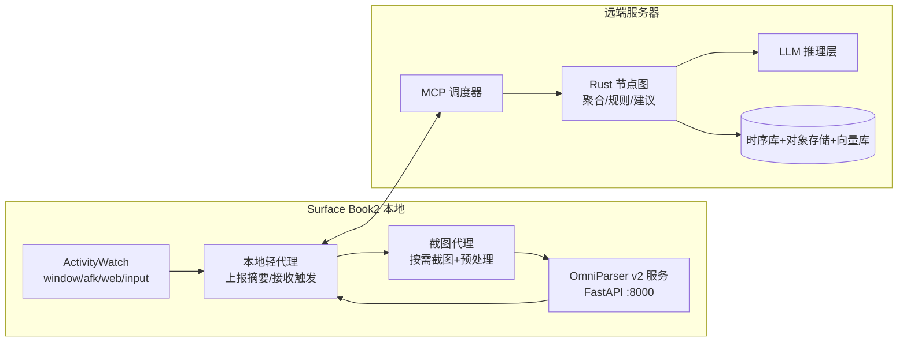
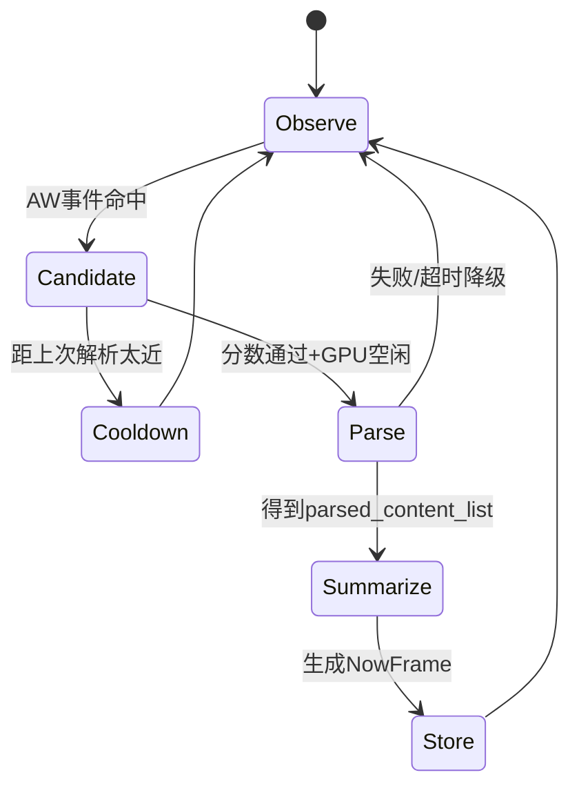
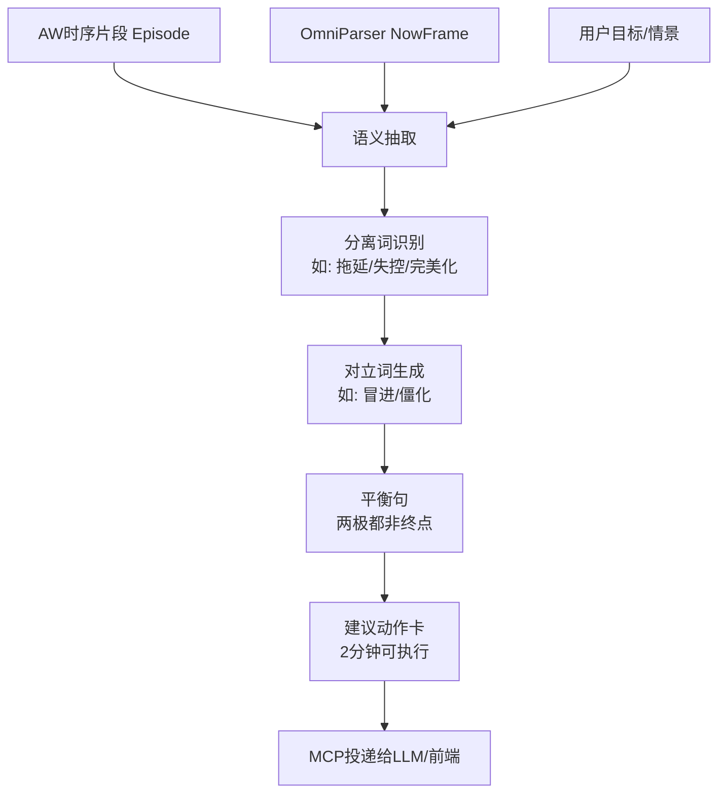

# OmniParser v2 本地部署与“共时”信息架构（Surface Book2 方案）

> 目标：把 **OmniParser 本地解析能力** 放到正确位置：不追求全时实时，而是与 ActivityWatch + 远端 MCP/Rust 形成“按需高信息密度”协作。

## 0. 先给结论（TL;DR）

- 你的主线是对的：**OmniParser 本地跑 + ActivityWatch 持续采样 + 远端 MCP 编排触发**，比“全时视觉解析”更符合 1060 算力现实。
- 在 Surface Book2（i7/16G/GTX1060）上，OmniParser 更适合 **事件触发模式**：通常按场景每 30s~5min 触发一次，或只在“需要建议/复盘/学习”时触发。
- 把系统拆成三层：
  1) **连续低成本层**（AW）
  2) **按需高语义层**（OmniParser）
  3) **聚合与建议层**（Rust 节点图 + MCP + LLM）
- “反义词节点”建议作为**语义压缩与平衡调度器**，不直接绑死在视觉模型里，先做规则/模板节点，后续再接 embedding/CLIP/VLA。

---

## 1. OmniParser 在你的系统里到底扮演什么角色？

OmniParser 是“屏幕结构化解析器”，不是完整 agent。

它做得好的：
- 把截图转成结构化 UI 元素：`bbox + 类型 + 文本/图标语义 + 可交互性`。
- 给后续大模型一个“压缩后的视觉上下文”，减少纯像素推理负担。

它不做的：
- 不长期记忆用户行为。
- 不负责调度触发（这应由 AW + Rust 逻辑做）。
- 不直接等价于“共时理解”。

所以你的“共时”工程映射应是：
- AW 提供“时间连续性”；
- OmniParser 提供“当下界面语义”；
- Rust/MCP 做“何时触发 + 如何聚合 + 怎样建议”。

---

## 2. 版本与官方事实（用于部署校准）

- GitHub 最新 release（截至 2026-02-17）：`v.2.0.1`（2025-09-12）。
- V2 模型卡公开指标：
  - 相比 V1 延迟改善约 60%
  - 平均延迟：A100 约 0.6s/frame，单 4090 约 0.8s/frame
  - ScreenSpot Pro 平均准确率约 39.6

> 注：这些是官方高端卡参考值，不可直接等同 1060 表现，应作为“相对量级”参考。

---

## 3. 你的硬件（Surface Book2 顶配）下的可行性与资源占用

## 3.1 硬件约束（关键）

- CPU：i7（移动平台）
- 内存：16GB（这是系统瓶颈之一）
- GPU：GTX 1060（通常 6GB VRAM）

OmniParser v2 典型组合是：
- YOLO 检测（icon detect）
- Florence-2 caption（icon caption）
- OCR（默认路径常见 EasyOCR；PaddleOCR 也可选）

### 3.2 资源占用（实战估算，按单实例）

| 指标 | 估算区间（1060） | 说明 |
| --- | --- | --- |
| 显存占用（稳态） | 4.5GB ~ 6GB | 与分辨率、元素数量、batch 有关 |
| 系统内存占用 | 6GB ~ 10GB | Python + OCR + 模型 + 缓冲 |
| 冷启动耗时 | 20s ~ 90s | 首次加载权重/初始化 |
| 单帧解析延迟（1080p） | 8s ~ 25s | UI复杂度、OCR量、CPU负载影响很大 |
| 单帧解析延迟（900p/720p） | 4s ~ 15s | 降分辨率可明显改善 |

> 结论：你听到的“10秒一张”在这台机器上是合理预期，不建议追求持续实时流。

### 3.3 在 1060 上优先做的 4 个优化

1. **触发优先于轮询**：只在关键时刻 parse。
2. **分辨率控制**：默认 1600x900 或更低；必要时再全分辨率。
3. **冷却窗口**：两次 parse 间隔至少 60~120 秒（可动态）。
4. **单实例服务常驻**：避免每次重启模型（冷启动太贵）。

---

## 4. 部署拓扑（你当前设想的推荐落地）

你给的约束：
- OmniParser：本地（Surface Book2）
- ActivityWatch：本地连续跑
- MCP 触发：另一台服务器
- Rust 节点图：位置待定（可先远端）

推荐拓扑如下：



关键点：
- 远端 MCP **不要直接访问本机 localhost:8000**，而是通过本地 EDGE 代理做双向控制。
- 本地 EDGE 只上传必要字段（可脱敏），避免原始截图全量外流。

---

## 5. 触发策略：让 OmniParser 成为“高价值镜头”

## 5.1 触发来源

主要用 AW 信号生成触发候选：
- `currentwindow` 高频切换（上下文抖动）
- `afk -> not-afk` 回归
- `web.tab.current` 域名/标题变化到目标学习域
- `os.hid.input` 强度异常（高或低）
- 用户主动请求（“给建议/复盘/讲解”）

## 5.2 触发门控（推荐）

触发分数（示例）：

```text
trigger_score = w1*switch_rate + w2*novelty + w3*user_request + w4*uncertainty - w5*gpu_busy
```

触发条件：
- `trigger_score > threshold`
- 且距上次 parse 超过 cooldown

## 5.3 状态机（GitHub 可渲染）



---

## 6. 接口形式（你后续对接 Rust/MCP 最需要先定的部分）

## 6.1 OmniParser 服务接口（本地）

官方 omnitool 中的服务形态：FastAPI
- 健康检查：`GET /probe/`
- 解析接口：`POST /parse/`

请求示例：

```json
{
  "base64_image": "..."
}
```

返回示例（关键字段）：

```json
{
  "som_image_base64": "...",
  "parsed_content_list": [
    {
      "type": "text",
      "bbox": [0.12, 0.08, 0.44, 0.14],
      "interactivity": false,
      "content": "Chapter 3",
      "source": "box_ocr_content_ocr"
    },
    {
      "type": "icon",
      "bbox": [0.78, 0.03, 0.82, 0.08],
      "interactivity": true,
      "content": "search",
      "source": "box_yolo_content_yolo"
    }
  ],
  "latency": 9.7
}
```

## 6.2 AW -> Rust 的统一事件接口（建议）

```json
{
  "ts": "2026-02-17T12:03:11Z",
  "host": "surface-book2",
  "event_type": "currentwindow",
  "data": {
    "app": "Code",
    "title": "[P:Replicant] OP.md"
  },
  "duration": 12.4
}
```

## 6.3 Rust/MCP -> 本地 EDGE 的触发接口（建议）

```json
{
  "trace_id": "trg_20260217_1203_01",
  "reason": "context_switch_spike",
  "capture": {
    "monitor": "active",
    "max_resolution": "1600x900"
  },
  "parser": {
    "box_threshold": 0.05,
    "timeout_sec": 30
  }
}
```

---

## 7. 与“反义词节点图”的关系（简要，先可用再做复杂）

你提到“反义词练习（太傻体系）”用于绕过形式主义，这在工程里很适合做 **认知压缩节点**。

建议先做轻量规则节点，而不是一开始就上复杂 VLA：
- 输入：NowFrame + AW episode + 用户目标
- 输出：`分离词 -> 对立词 -> 平衡句 -> 下一步动作`



这让“共时”不只靠视觉，而是靠**视觉+行为+认知平衡模板**同时收敛。

---

## 8. 存储与检索（围绕“信息量和组织问题”）

先避免“全量存图 + 全量向量化”的暴涨方案，建议三层存储：

1. `raw_events`（AW 原始）
- 低成本长期保存，可追溯。

2. `episodes`（时间片聚合）
- 每 30s~5min 形成一个片段，记录 app/tab/afk/input 摘要。

3. `nowframes`（高语义快照）
- 只在触发时保存 OmniParser 输出 + 摘要 + 置信度 + 触发原因。

检索顺序：
- 先结构过滤（时间、应用、项目标签）
- 再 embedding 重排（可选）

这样能兼顾：
- 丰富度（有视觉）
- 准确性（有时序上下文）
- 流式响应（不必每次都跑视觉）

---

## 9. 部署建议（按阶段，不一次做满）

### Phase 1：OmniParser 本地单点跑通（1~2 天）

- 本地启动 OmniParser FastAPI 常驻
- 手动喂截图，验证延迟和显存占用
- 输出落到本地 JSON

### Phase 2：接 AW 触发（3~7 天）

- 本地 EDGE 订阅 AW REST 数据
- 规则触发 parse + cooldown
- 形成 `NowFrame` 并保存

### Phase 3：接远端 MCP/Rust（1~2 周）

- 远端下发触发请求，本地执行 parse
- 远端完成聚合、建议、可视化
- 反义词节点先规则化，embedding/CLIP 后置

---

## 10. 你现在最关心的 4 个“工程落点”

1) **OmniParser 部署落点**：本地常驻服务（确定）。
2) **触发落点**：远端 MCP 可发令，但本地 EDGE 必须掌握最终执行权（隐私+延迟）。
3) **聚合落点**：Rust 节点图可先远端；如果后续隐私要求高，再迁本地。
4) **反义词/嵌入落点**：先做结构化节点，再决定 embedding/CLIP/VLA 的部署位置。

---

## 11. 实操备注（避免踩坑）

- OmniParser 源码里 `device` 参数在部分路径并不完全按传参生效，初始化常会自动走 `torch.cuda.is_available()` 分支；部署前建议你本地实测并固定配置。
- OCR 路径与 GPU 冲突要注意（某些 Paddle 配置会主动禁 GPU），别把 OCR 当成“自动 GPU 加速”。
- Windows 环境若遇到 Paddle 相关 `libpaddle` 报错，先补齐 VC++ 运行库后重装依赖。
- Surface Book2 的散热/降频会显著影响持续延迟，建议跑批时接电源并使用高性能电源模式。

---

## 12. 参考链接（官方优先）

- OmniParser GitHub: <https://github.com/microsoft/OmniParser>
- OmniParser 最新 release: <https://github.com/microsoft/OmniParser/releases>
- OmniParser v2 模型卡（延迟/指标）: <https://huggingface.co/microsoft/OmniParser-v2.0>
- OmniTool README（服务拆分与部署）: <https://github.com/microsoft/OmniParser/tree/master/omnitool>
- ActivityWatch 数据模型: <https://docs.activitywatch.net/en/latest/buckets-and-events.html>
- ActivityWatch 配置: <https://docs.activitywatch.net/en/latest/configuration.html>
- ActivityWatch 同步（aw-sync）: <https://docs.activitywatch.net/en/latest/syncing.html>

