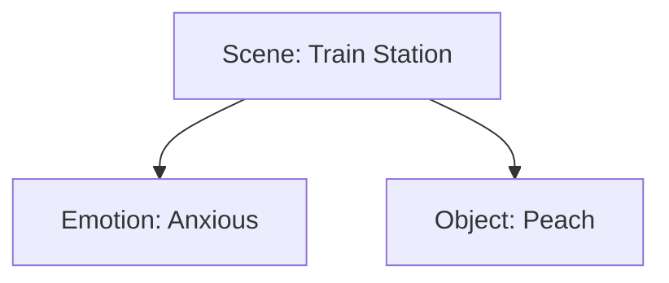
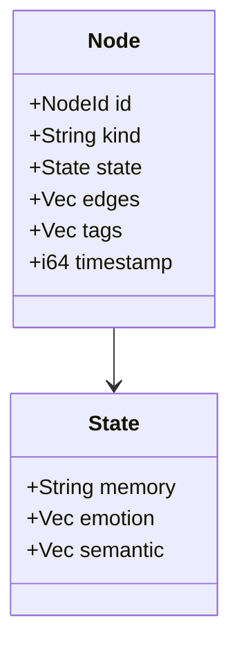

# Rust Node Design (Index-Based / Arena Style)

> Goal: fast, hardware-friendly, and highly connected graphs for “dream programming”.

---

## 1) Core idea: **indices over pointers**
Instead of `Rc<Box<Node>>` pointing to each other, keep **all nodes in a single `Vec<Node>`**, and make edges store **IDs** (indices).

- **Storage**: `Vec<Node>` (contiguous memory, cache-friendly)
- **Reference**: `NodeId(u32)` or `usize`
- **Edge**: `Vec<NodeId>`

### Why it’s faster
- **CPU cache wins**: `Vec` is contiguous; pointer chains jump around memory.
- **Less overhead**: no ref-counting, no borrow juggling.
- **Predictable layout**: easier to serialize and debug.

---

## 2) Minimal structure (conceptual)
```
Vec<Node> + NodeId
Node { id, kind, state, edges, tags, timestamp }
```

### Mermaid (data layout)
```mermaid
flowchart LR
  subgraph Arena[Vec<Node> (Arena)]
    N0[NodeId 0\nkind: "scene"\nedges: [1,2]]
    N1[NodeId 1\nkind: "object"\nedges: [2]]
    N2[NodeId 2\nkind: "emotion"\nedges: []]
  end
  N0 --> N1
  N0 --> N2
  N1 --> N2
```

---

## 3) Example in plain language
**Scenario:** “I dreamed of a train station, felt anxious, then saw a peach.”

We create nodes:
- **Scene**: “train station”
- **Emotion**: “anxious”
- **Object**: “peach”

Edges show relationships:
- scene → emotion
- scene → object

### Mermaid (story graph)


This keeps the graph **simple, fast, and human-readable**.

---

## 4) Why NOT raw pointers / linked lists
- **Linked lists** are slow on modern CPUs (cache misses).
- **Pointers** force complex lifetime rules in Rust.
- **Rc/RefCell** adds runtime overhead and can create cycles.

In practice, **Vec + NodeId** beats pointer graphs for most workloads.

---

## 5) Serialization is easy
Because everything is IDs + arrays, you can dump to JSON, store in DB, or stream over network:

```json
{
  "nodes": [
    {"id": 0, "kind": "scene", "edges": [1,2]},
    {"id": 1, "kind": "object", "edges": [2]},
    {"id": 2, "kind": "emotion", "edges": []}
  ]
}
```

---

## 6) Optional: richer node state
You can make `state` hold richer memory/emotion/semantic vectors:

- `state.memory`: free text or summary
- `state.emotion`: valence/arousal vector
- `state.semantic`: embedding vector (f32[])

### Mermaid (state detail)


---

## 7) When to upgrade to SlotMap
If nodes get deleted often, plain Vec indices can break. Use **slotmap** to keep IDs stable:

- `slotmap::SlotMap<NodeId, Node>`
- IDs remain valid even after deletions

---

## 8) Summary (one line)
**For fast, hardware-friendly, highly connected graphs in Rust: use an arena (`Vec`/`SlotMap`) and reference by `NodeId`.**
