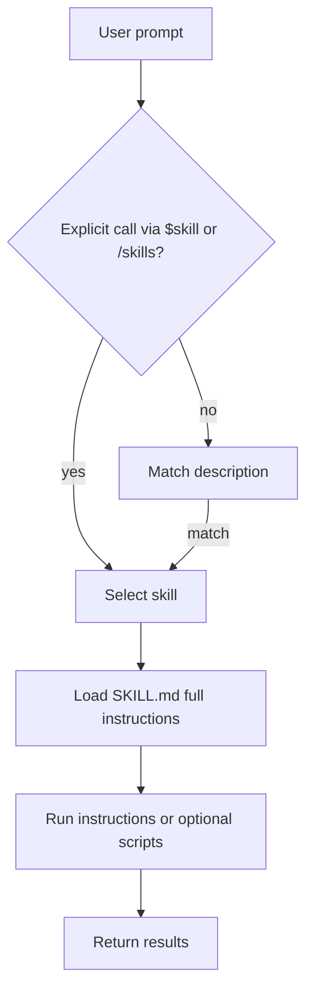
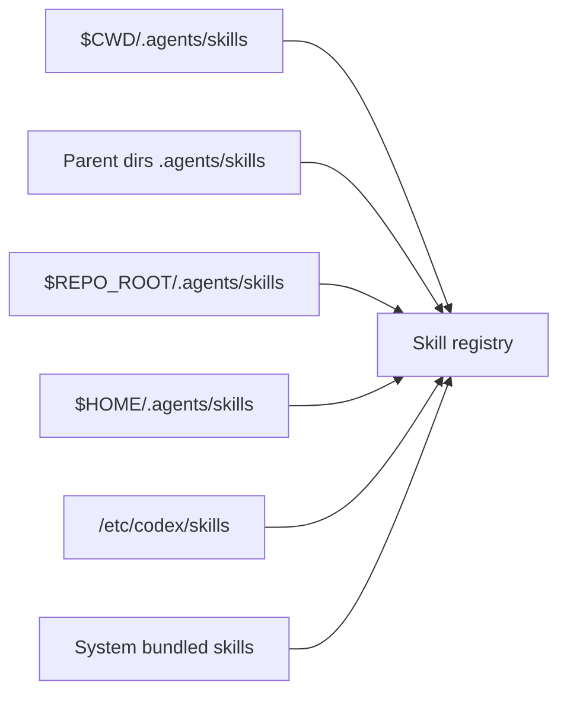
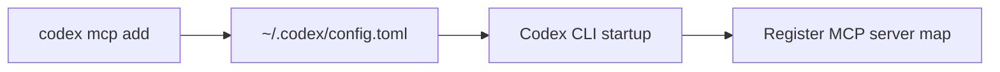
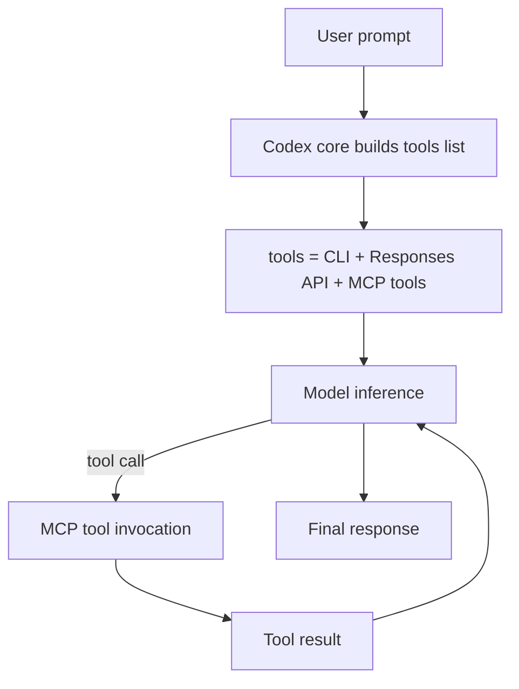

# Codex Skills 与 MCP 说明（GitHub Markdown 版）

## A. Skills

### 1) Skills 是什么 & 文件结构（CLI 视角）

官方定义里，Skill 是一个目录，核心文件是 `SKILL.md`，可选脚本与参考资料。`SKILL.md` 必须包含 `name` 和 `description`。

典型结构：

```text
my-skill/
  SKILL.md              # 必填：元信息 + 使用说明
  scripts/              # 可选：脚本
  references/           # 可选：参考资料
  agents/openai.yaml    # 可选：UI/策略/依赖声明
```

参考：<https://developers.openai.com/codex/skills>

---

### 2) Skills 的执行逻辑（Progressive Disclosure）

Codex 先读元信息（`name` / `description` / 路径 / 可选 metadata），只有决定使用时才加载完整 `SKILL.md`，从而节省上下文。

触发方式有两种：

- 显式调用：在 CLI/IDE 用 `/skills`，或输入 `$skill` 直接点名。
- 隐式调用：任务描述匹配 skill 的 `description` 自动触发。

你可以控制隐式触发：在 `agents/openai.yaml` 里将 `allow_implicit_invocation: false`，只允许显式调用。

参考：<https://developers.openai.com/codex/skills>

---

### 3) Skills 的扫描与加载路径（放在哪里）

Codex 会扫描多个位置（从当前目录向上直到 repo root）：

- Repo 级：`$CWD/.agents/skills` -> 向上直到 `$REPO_ROOT/.agents/skills`
- User 级：`$HOME/.agents/skills`
- Admin 级：`/etc/codex/skills`
- System 级：Codex 自带内置技能

同时支持 symlink。

参考：<https://developers.openai.com/codex/skills>

---

### 4) Skills 的启用/禁用（配置）

可在 `~/.codex/config.toml` 里禁用某个 skill：

```toml
[[skills.config]]
path = "/path/to/skill/SKILL.md"
enabled = false
```

参考：<https://developers.openai.com/codex/skills>

---

### 5) Mermaid：Skills 执行逻辑图



### 6) Mermaid：Skills 扫描图



---

## B. MCP（Model Context Protocol）

### 1) MCP 是什么（在 Codex 语境）

MCP（Model Context Protocol）是一个开放协议，用来把模型连接到外部工具/数据能力；远程 MCP 服务器可以把新数据源和能力接入模型。

参考：<https://platform.openai.com/docs/mcp>

---

### 2) Codex CLI 里的“文件 & 命令”层

配置文件位置（核心 “map”）：

MCP 服务器在 `~/.codex/config.toml` 里以 map（TOML table）形式保存，key 是服务器名。

```toml
[mcp_servers.openaiDeveloperDocs]
url = "https://developers.openai.com/mcp"
```

也可以用 CLI 命令写入：

- `codex mcp add <name> --url <server>`
- `codex mcp list`

并且 CLI/IDE 配置共享。

参考：<https://platform.openai.com/docs/docs-mcp>

---

### 3) Codex 内部执行逻辑（程序层）

Codex 的 core agent loop 会把 MCP servers 和 Skills 接入同一套 policy 模型：

- Codex 会在 agent loop 中把 MCP servers 和 Skills 接入同一套 policy 模型。
- 在模型推理时，`tools` 列表里包含：
  1. Codex CLI 自带工具
  2. Responses API 工具
  3. 用户通过 MCP servers 提供的工具

> 重要：MCP 工具不受 Codex shell 沙箱约束，它们必须自行负责安全/约束。

参考：
- <https://openai.com/index/unlocking-the-codex-harness/>
- <https://openai.com/index/unrolling-the-codex-agent-loop/>

---

### 4) Mermaid：MCP 配置与运行流程

A. 配置/注册层



B. 运行/执行层



---

### 5) 你说的 “map” 在 MCP 里的含义

“map”本质就是 config 里的 `mcp_servers` 映射表：

- key：server label
- value：server URL

这是 Codex CLI 能发现/连接 MCP 的核心入口。

参考：<https://platform.openai.com/docs/docs-mcp>
