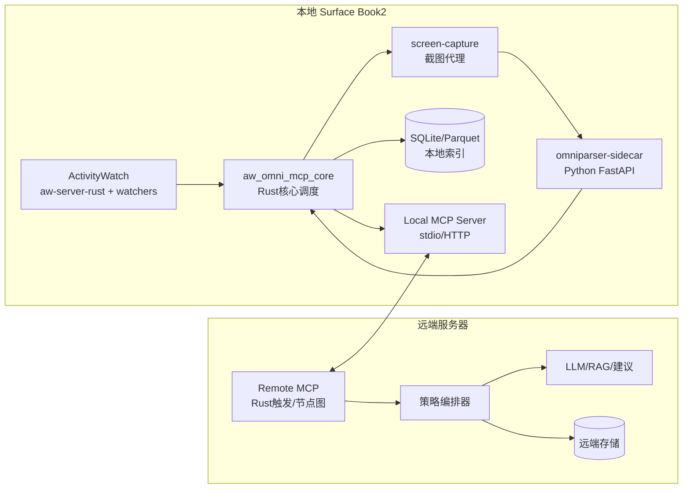
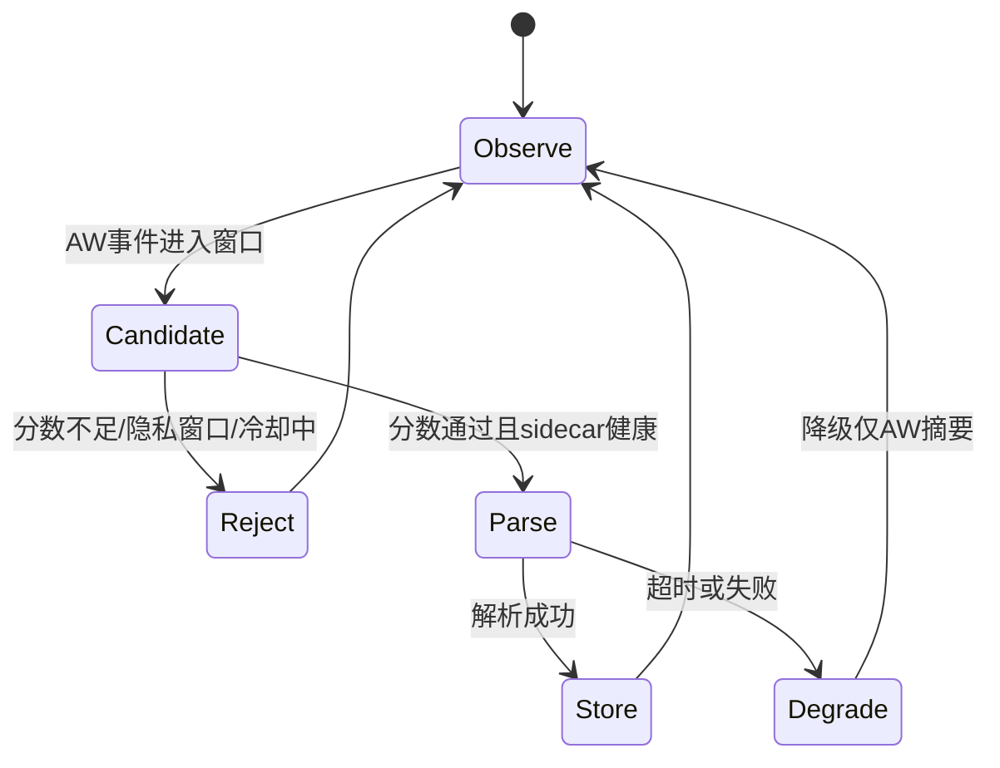
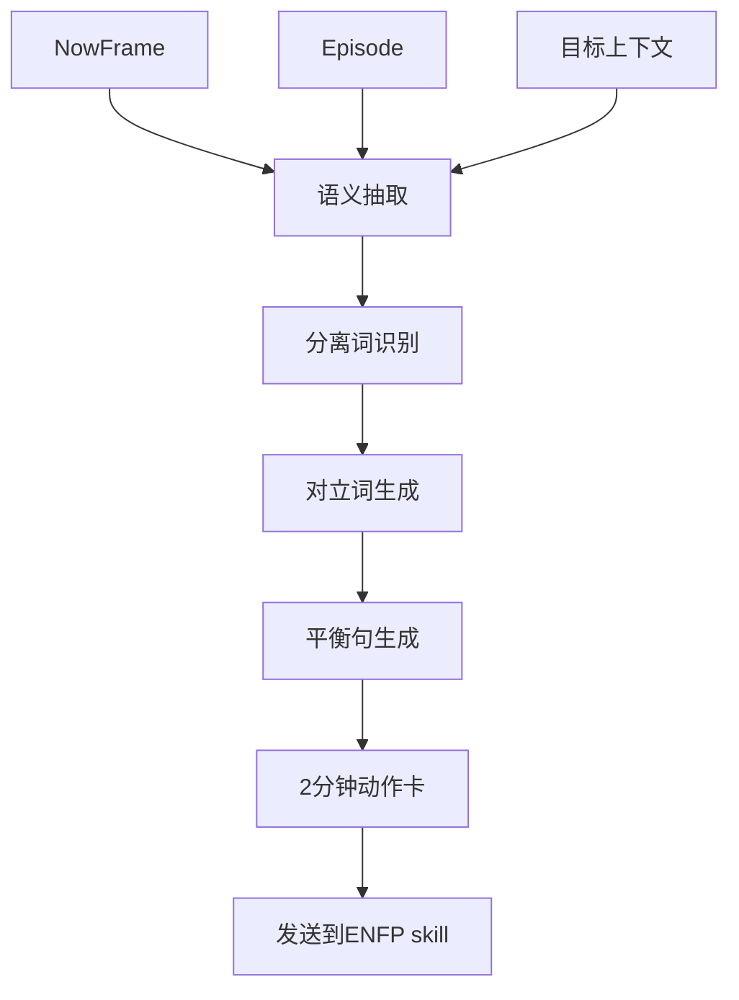

# codex_000_MCP：AW + OmniParser Rust 优先一体化 MCP 开发计划（Surface Book2）

> 目标：在 **Surface Book2（i7 / 16G / GTX1060）** 上，采用 **A 档方案：Rust 控制面 + Python 推理 sidecar（80%~90% Rust 化）**，把本地 `ActivityWatch + OmniParser` 做成高效 MCP，后续与远端 Rust 触发/MCP 编排对接。

---

## 0. 已确认现状（基于 `FIrst.md`）

根据 `/home/snw/文档/SNW_Codex/Oc/FIrst.md`（记录时间 2026-01-29）：

- ActivityWatch 已在 WSL + Windows 路线跑通，且包含 `aw-server-rust`。
- 关键目录已落在 F 盘：`F:\exe\SNW_AW\...`
- Windows watcher 已可连接 `localhost:5600`。
- 你明确了当前约束：
  - **F 盘剩余约 11G**（需严控截图与缓存）
  - Python 环境主要在 D 盘（OpenCV/NumPy/PyTorch CUDA 已可用）
  - OmniParser 尚未下载，准备按“Rust 控制面 + 推理 sidecar”实施。

这意味着：
- 你已经有“连续行为数据底座”（AW）。
- 下一步关键是：把 OmniParser 变成**按需语义增强能力**，并与 AW 触发链闭环。

---

## 1. 总体方案（为什么是 A 档）

## 1.1 方案定义

A 档：
- Rust 负责：采集、触发、调度、缓存、存储、MCP 工具暴露、与远端交互。
- Python sidecar 负责：OmniParser 模型推理（检测 + OCR + caption）。

## 1.2 为什么不是“全 Rust 重写 OmniParser”

- OmniParser 当前核心依赖 `torch/transformers/ultralytics/easyocr/paddleocr`。
- 完整重写推理栈成本高、周期长、性能收益不确定。
- 你当前目标是“高效可用 + 快速闭环”，A 档可以最快达到。

## 1.3 Rust 化比例（现实可达）

- 控制面与数据面：90% 可 Rust。
- 推理核：先保留 Python sidecar。
- 综合项目 Rust 比例：约 80%~90%。

---

## 2. 目标架构（本地 MCP + 远端 MCP）



架构原则：
- 本地 MCP 掌握执行权（隐私、冷却、GPU busy 判断）。
- 远端 MCP 做策略与编排，不直接裸连 OmniParser 推理接口。

---

## 3. 耦合策略：AW 与 OmniParser 保持“中低耦合”

## 3.1 推荐耦合等级

- 耦合等级：**2.5 / 5（中低）**。
- 做法：
  - AW 提供持续时序信号。
  - OmniParser 只在触发时被调用。
  - 在 Rust 聚合层生成 `NowFrame`。

## 3.2 不推荐做法

- 不要每秒截图并调用 OmniParser（1060 + 11G 空间不可持续）。
- 不要让 AW 进程直接依赖 OmniParser 进程（会放大故障耦合）。

---

## 4. 磁盘与缓存规划（F 盘仅 11G 的硬约束）

## 4.1 目录规划（建议）

```text
F:\SNW_MCP\
  runtime\
    logs\
    pid\
  data\
    aw_raw\
    episodes\
    nowframes\
  cache\
    screenshots\
    thumbs\
    sidecar_tmp\
  models\
    omniparser\weights\
  release\
    aw_omni_mcp\
```

如果 sidecar 在 Windows Python 环境运行，强烈建议设置：

```powershell
$env:HF_HOME="F:\SNW_MCP\cache\hf"
$env:TRANSFORMERS_CACHE="F:\SNW_MCP\cache\hf\transformers"
$env:TORCH_HOME="F:\SNW_MCP\cache\torch"
$env:TEMP="F:\SNW_MCP\cache\tmp"
$env:TMP="F:\SNW_MCP\cache\tmp"
```

## 4.2 空间预算（初版）

| 项目 | 预算 |
| --- | --- |
| OmniParser 权重 | 2.5G ~ 4.0G |
| sidecar 运行缓存 | 1.0G |
| 截图缓存（环形） | 1.5G |
| 本地数据库/索引 | 1.0G |
| 日志与临时文件 | 0.5G |
| 预留 | 2.0G |

策略：
- 截图只保留最近 24h 或最近 N 张。
- 原图可删，保留结构化 `parsed_content_list` + 低分辨率缩略图。

---

## 5. 组件拆分（Rust workspace 结构）

## 5.1 建议仓库结构

```text
aw-omni-mcp/
  Cargo.toml
  crates/
    aw_client/            # AW REST 客户端
    trigger_engine/       # 触发评分与状态机
    capture_agent/        # 截图代理
    omni_client/          # sidecar HTTP 客户端
    nowframe_core/        # AW+Omni 融合模型
    storage/              # SQLite/Parquet
    mcp_server/           # MCP tools 暴露
    bridge_remote/        # 远端 MCP 通讯（可选）
  sidecar/
    omniparser_sidecar/   # Python FastAPI 包装
  scripts/
    bootstrap.ps1
    run_local.ps1
    package_release.ps1
  README.md
```

## 5.2 Rust 进程建议

- `aw-omni-daemon`：常驻，负责调度与存储。
- `aw-omni-mcp`：MCP 接口层（可与 daemon 同进程，也可分离）。

---

## 6. 协议设计（接口先定，后续重写不痛）

## 6.1 本地 sidecar 接口（Rust -> Python）

### `GET /probe`

返回：

```json
{"ok": true, "model": "omniparser-v2", "gpu": "cuda:0"}
```

### `POST /parse`

请求：

```json
{
  "trace_id": "tr_20260218_001",
  "image_base64": "...",
  "options": {
    "box_threshold": 0.05,
    "max_resolution": "1600x900"
  }
}
```

响应：

```json
{
  "trace_id": "tr_20260218_001",
  "latency_ms": 9800,
  "som_image_base64": "...",
  "parsed_content_list": [
    {
      "type": "text",
      "bbox": [0.12, 0.08, 0.44, 0.14],
      "interactivity": false,
      "content": "Chapter 3",
      "source": "box_ocr_content_ocr"
    },
    {
      "type": "icon",
      "bbox": [0.78, 0.03, 0.82, 0.08],
      "interactivity": true,
      "content": "search",
      "source": "box_yolo_content_yolo"
    }
  ]
}
```

## 6.2 MCP Tools（本地）

建议暴露以下工具：

1. `aw.get_slice`
2. `aw.get_state`
3. `omni.parse_screen`
4. `nowframe.build`
5. `nowframe.query`
6. `system.health`

`nowframe.build` 请求示例：

```json
{
  "tool": "nowframe.build",
  "arguments": {
    "reason": "context_switch_spike",
    "capture_mode": "active_window",
    "trigger_score": 0.82
  }
}
```

`nowframe.build` 响应示例：

```json
{
  "nowframe_id": "nf_20260218_103012",
  "aw_summary": {
    "focus_app": "Code",
    "switch_rate_5m": 0.37,
    "afk_state": "not-afk"
  },
  "omni_summary": {
    "elements": 47,
    "interactable": 18,
    "latency_ms": 9460
  },
  "storage": {
    "sqlite_id": 12093,
    "thumb_path": "F:/SNW_MCP/cache/thumbs/nf_20260218_103012.jpg"
  }
}
```

## 6.3 与远端 MCP 的接口（建议）

远端触发请求：

```json
{
  "trace_id": "rtrg_20260218_001",
  "intent": "learning_assist",
  "min_interval_sec": 90,
  "privacy_level": "redacted",
  "parse_policy": {
    "mode": "active_window",
    "max_resolution": "1600x900"
  }
}
```

本地返回：

```json
{
  "accepted": true,
  "reason": "trigger_pass",
  "nowframe_id": "nf_20260218_103012"
}
```

---

## 7. 触发引擎设计（Rust）

## 7.1 触发因子

- `switch_rate_5m`：5分钟窗口切换频率
- `novelty_score`：当前窗口/域名新颖度
- `input_delta`：输入强度变化
- `user_intent_flag`：用户显式求助
- `gpu_busy_penalty`：GPU繁忙惩罚

评分公式示例：

```text
score = 0.35*switch_rate + 0.25*novelty + 0.25*user_intent + 0.15*input_delta - 0.30*gpu_busy
```

## 7.2 状态机



---

## 8. 数据模型（NowFrame 核心）

## 8.1 结构定义（建议）

```json
{
  "nowframe_id": "nf_20260218_103012",
  "trace_id": "tr_20260218_001",
  "ts": "2026-02-18T10:30:12Z",
  "source": "local_aw_omni_mcp",
  "aw": {
    "focus_app": "Code",
    "focus_title": "[P:Replicant] codex_000_MCP.md",
    "afk": "not-afk",
    "switch_rate_5m": 0.37
  },
  "omni": {
    "latency_ms": 9460,
    "elements": 47,
    "interactable": 18,
    "parsed_content_list": []
  },
  "policy": {
    "privacy_level": "redacted",
    "capture_mode": "active_window"
  }
}
```

## 8.2 存储策略

- SQLite：元数据、索引、快速查询。
- Parquet（可选）：分析批处理。
- 文件系统：缩略图与可选 SOM 图。

---

## 9. 反义词节点（先规则，后向量）

你提到“反义词节点图”的方向很关键，建议作为远端 Rust 节点实现：

输入：
- `nowframe`
- `episode`
- `user_goal`

输出：
- `分离词`
- `对立词`
- `平衡句`
- `下一步动作（2分钟）`



注意：
- 第一版不要依赖 CLIP/VLA 才能运行。
- 先可解释规则，后续再把 embedding 融进去做重排与匹配。

---

## 10. 典型应用场景（端到端示例）

## 10.1 学习建议场景

1. AW 发现 5 分钟内窗口切换激增。
2. 触发分数 > 阈值，本地抓取 active window。
3. sidecar 解析出当前页面包含“课程目录 + 练习入口 + 未完成题目”。
4. Rust 生成建议：
   - “先做第 1 题 2 分钟”
   - “如果卡住，先只写题干关键词”
5. 远端 MCP 结合你历史 episode 做个性化重排。

## 10.2 低打扰陪伴场景

1. AW 显示长时间 not-afk 但输入低。
2. 仅 AW 摘要触发（不跑 Omni，节省算力）。
3. 远端给出轻提醒：喝水/伸展/2分钟 micro action。

## 10.3 深度复盘场景

1. 用户主动说“复盘”。
2. 本地连续采样 2~3 次 Omni（带 cooldown）。
3. 汇总为“任务流 + 阻塞点 + 建议动作”。

---

## 11. 性能目标（第一版可验收指标）

| 指标 | 目标 |
| --- | --- |
| AW 拉取延迟 | < 300ms |
| Omni parse P50（900p） | <= 10s |
| Omni parse P95（900p） | <= 18s |
| NowFrame 组装耗时 | < 500ms（不含 parse） |
| 本地磁盘增长 | <= 1.5G / 周（默认策略） |
| MCP 工具成功率 | >= 99%（不含模型失败） |

---

## 12. 打包、发布、Git 规范（可直接执行）

## 12.1 本地打包物

发布目录建议：

```text
release/
  aw-omni-mcp.exe
  aw-omni-daemon.exe
  sidecar/
    run_sidecar.ps1
    requirements.lock.txt
    omniparser_sidecar/
  config/
    config.toml
  README.md
  LICENSE
```

## 12.2 Git 分支与标签策略

- `main`：稳定发布。
- `dev`：日常开发。
- `feat/*`：功能分支（如 `feat/trigger-engine`）。
- tag：`v0.1.0`, `v0.2.0`。

## 12.3 Release checklist

1. `cargo test --workspace`
2. sidecar 健康检查脚本通过
3. 关键 MCP tools 冒烟测试通过
4. 空间回收脚本执行一次
5. 更新 README（安装/配置/已知问题）

---

## 13. README 建议模板（仓库根）

README 最少要有：

1. 项目定位（一句话）
2. 架构图（本地/远端）
3. 快速开始（5 分钟）
4. 配置说明（尤其 F 盘路径）
5. MCP Tools 列表与示例
6. 性能建议（1060 场景）
7. 常见故障与排查
8. 隐私与数据策略
9. Roadmap

---

## 14. 分阶段开发排期（建议 4 周）

## Week 1：骨架搭建
- Rust workspace 初始化
- AW client + sidecar client 打通
- `system.health` + `aw.get_state` + `omni.parse_screen` 3个工具

## Week 2：触发闭环
- trigger engine + cooldown + queue
- `nowframe.build` 完成
- 本地 SQLite 落地

## Week 3：远端编排接入
- 本地/远端 MCP 通讯
- 远端触发请求与回执
- 场景策略 2~3 条

## Week 4：稳定化与发布
- 性能压测
- 磁盘回收策略
- 打包脚本 + README + v0.1.0 发布

---

## 15. 最小可运行命令示例（草案）

## 15.1 启动 sidecar（示例）

```powershell
cd F:\SNW_MCP\release\sidecar
.\run_sidecar.ps1
```

## 15.2 启动 Rust daemon

```powershell
cd F:\SNW_MCP\release
.\aw-omni-daemon.exe --config .\config\config.toml
```

## 15.3 启动 MCP server

```powershell
cd F:\SNW_MCP\release
.\aw-omni-mcp.exe --transport stdio
```

## 15.4 调用工具（伪示例）

```json
{"tool":"system.health","arguments":{}}
{"tool":"aw.get_state","arguments":{}}
{"tool":"nowframe.build","arguments":{"reason":"manual_review"}}
```

---

## 16. 风险与缓解

| 风险 | 表现 | 缓解 |
| --- | --- | --- |
| 1060 解析慢 | 10~20s 波动 | 降分辨率 + 触发式 + cooldown |
| F 盘爆满 | 服务异常/崩溃 | 环形缓存 + TTL + 每日清理任务 |
| sidecar 崩溃 | parse 超时 | Rust 熔断 + 自动重启 + 降级AW-only |
| 远端不可达 | 编排中断 | 本地保底策略继续运行 |
| 隐私风险 | 截图敏感内容泄露 | 默认 redacted + 本地执行权 + 最小上传 |

---

## 17. 你可以直接执行的下一步（按优先级）

1. 在 F 盘创建目录骨架（`F:\SNW_MCP\...`）。
2. 下载 OmniParser v2 权重到 `F:\SNW_MCP\models\...`。
3. 起 sidecar 并跑 `probe/parse` 冒烟测试。
4. Rust 先实现 `aw.get_state` + `omni.parse_screen` + `nowframe.build`。
5. 接远端 MCP 的触发回路（先手动触发，再自动触发）。

---

## 18. 总结

你要的“极致产品 = 极致用心”在这个项目里的工程表达是：

- 用 AW 保持连续性（低成本）。
- 用 OmniParser提供关键时刻高信息密度（按需）。
- 用 Rust 把调度、结构、稳定性、可维护性做扎实。
- 用 MCP 把本地能力与远端认知编排优雅连接。

这条路线可以在你当前设备上落地，且能平滑演进到后续 embedding/CLIP/VLA。

