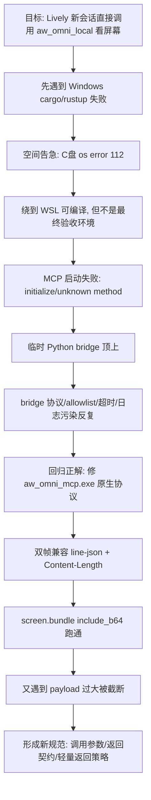
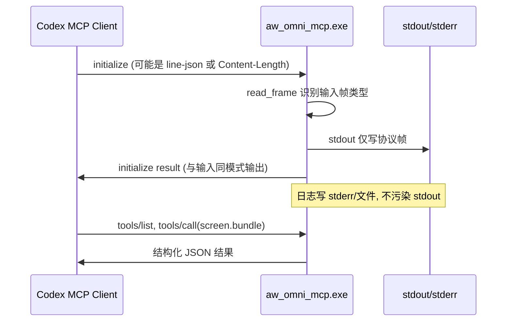
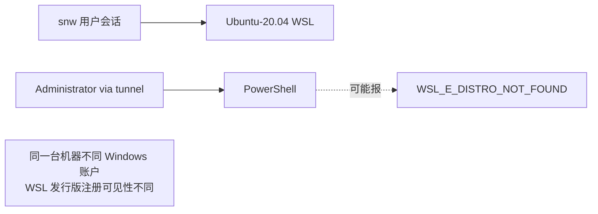
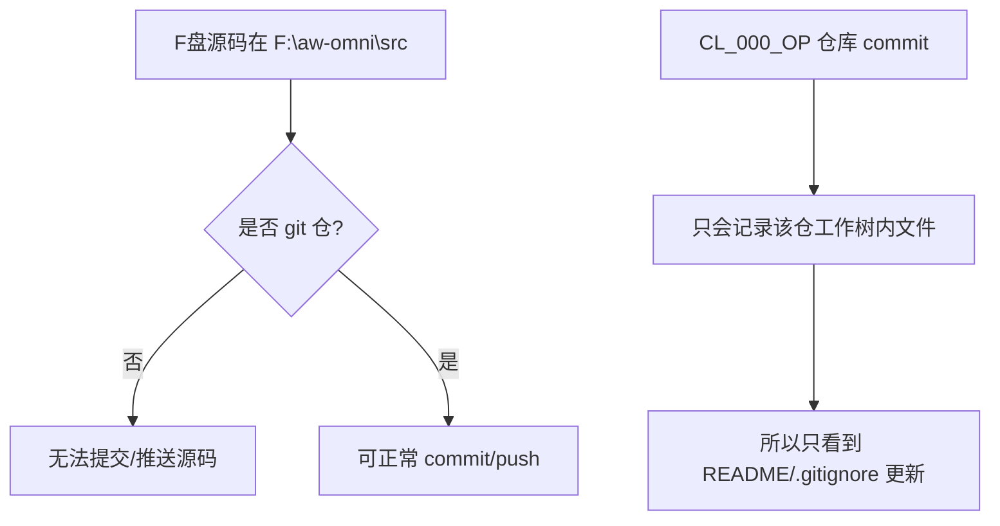

# codex_000_MCPinvoke：MCP 调用链路整天排障增量实录（仅补新经验）

> 文档定位：**增量复盘**。不重复 `codex_000_MCP.md` 与 `codex_001_omniSidecar.md` 已有计划/安装内容，只记录这次“调用跑通”新增的坑、根因、可复用操作法。

---

## 0. 这份增量到底补了什么

本次新增经验集中在三件事：

1. **调用链不是“代码能编译”就算通**：需要 `MCP client <-> server handshake <-> tools/call <-> sidecar` 全链路通过。
2. **Windows/WSL 混合场景的真实坑**：磁盘、路径、shell 引号、账号上下文、stdout/stderr 协议污染。
3. **源码落库与文档落库是两件事**：`F:\aw-omni\src` 非 git 仓时，怎么跑都不会自动同步到 GitHub。

---

## 1. 一天问题链路总览（前因后果）



---

## 2. 关键里程碑（按“影响最大”排序）

### 2.1 空间问题不是小问题，而是第一阻塞

- 现象：Windows `cargo check` / `rustup` 出现 `os error 112`（磁盘空间不足）。
- 关键事实：即使 F 盘有空间，`rustup` 默认路径仍可能落到 C 盘用户目录，导致“看起来有空间，实际仍失败”。
- 实战结论：
  - 不要在空间紧张时强行安装新 toolchain。
  - 优先复用已安装工具链（例如 `C:\Users\surface\.rustup\toolchains\stable-x86_64-pc-windows-msvc\bin\cargo.exe`）。
  - 把构建输出与临时目录明确放到 F 盘：
    - `CARGO_TARGET_DIR=F:\aw-omni\cache\aw_omni_target`
    - `TEMP=F:\aw-omni\cache\tmp`
    - `TMP=F:\aw-omni\cache\tmp`

### 2.2 WSL 能过不等于“目标环境”已过

- WSL `cargo +1.86.0 check` 通过，说明源码可编译。
- 但目标是 **Lively 本地新会话的 MCP 消费**，必须在最终客户端场景验收。
- 经验：把“编译通过”和“客户端能用”拆成两个验收关卡。

### 2.3 握手失败核心不是业务逻辑，而是协议帧

- 现象：
  - `MCP startup failed: ... initialize response`
  - `unknown method: initialize`
  - `unknown method: list_mcp_resources`
- 根因不是一个：
  1. 早期 server/bridge MCP 方法不全。
  2. 输入输出帧模式不匹配（有的客户端发 line-json，有的发 Content-Length）。
  3. stdout 混入非协议日志导致解析失败。

---

## 3. 握手问题的最终工程解法



### 3.1 必做改动（已验证）

- `aw_omni_mcp` 增加/补齐 MCP 基础方法：`initialize`、`tools/list`、`tools/call`、`shutdown`、`exit`。
- `read_frame` 支持两种输入：
  - `Content-Length`
  - 单行 JSON（line-json）
- `write_response` 输出与输入帧类型自适应（同模输出）。
- stdout 只允许协议帧；日志写 stderr 或文件（例如 `F:\aw-omni\cache\logs\aw_omni_mcp.log`）。

### 3.2 为什么之前桥接器会“看似可用但不稳”

- Python bridge 初期可顶上，但多次暴露协议边角问题：
  - 初始化方法不齐
  - 帧处理不严谨
  - allowlist 拒绝客户端（`Client not allowed`）
  - 工具调用超时时不易判断是 sidecar 卡住还是协议阻塞
- 结论：**桥可应急，产品长期应回归原生 server 稳态实现**。

---

## 4. 调用层面踩坑清单（“为什么会看起来离谱”）

### 4.1 `format_not_supported`

- 现象：`tools/call failed: -32000: format_not_supported`
- 根因：server 当前只支持 `png`。
- 对策：消费端调用必须显式带 `"format":"png"`，并在 schema 里收紧枚举，防模型乱传。

### 4.2 `tools/call` 超时 60s

- 现象：`timed out awaiting tools/call after 60s`
- 原因候选：
  - sidecar 推理慢或阻塞
  - rustup/cargo 锁占用
  - 工具输出解析空（例如 early 版本 `empty output`）
- 对策：
  - 先探活 `http://127.0.0.1:8000/probe`
  - 再看桥/服务日志
  - 不要让多个长命令并发卡住同一会话

### 4.3 “字段缺失”有时是假象（被截断）

- 现象：已返回超长 `annotated_b64`，但消费端判断 `CONTRACT_INCOMPLETE`。
- 关键线索：执行日志出现 `... tokens truncated ...`。
- 结论：不是服务端没返回，而是客户端上下文截断导致后续字段不可见。

### 4.4 路径存在性误判

- 现象：模型在 WSL 用 `python3 os.path.exists('F:\\...')` 得到 False，误判产物不存在。
- 根因：WSL 不能直接按 Windows 路径语义访问，需要 `/mnt/f/...` 或直接不做本地路径检查。
- 对策：在跨机/跨环境消费里，不依赖本地路径，优先用 b64 或对象存储 URL。

### 4.5 Bash + PowerShell 引号地狱

- 常见失败：
  - `$env:` 被 Bash 提前展开
  - `F:\...` 在不同层被吃掉反斜杠
- 对策：
  - 复杂命令尽量写入 `.ps1`，避免一行套多层 quote。
  - 若必须一行，外层单引号包住 `-Command` 主体，减少 Bash 插手。

---

## 5. Windows / WSL / 管理员账号的真实边界



- 现场现象：手动管理员能开 WSL，不代表 tunnel 进的 `Administrator` 会话也能看到同一发行版。
- 原因：WSL 发行版注册与账号上下文绑定（这是 Windows 层账户语义，不是项目 bug）。

---

## 6. 编译与空间管理：这次新增的“硬规范”

### 6.1 盘位策略

- **模型、缓存、target、tmp 全放 F 盘**。
- **尽量不触发 C 盘新下载**（尤其 rustup 组件安装）。

### 6.2 推荐命令模板（Windows 构建）

```powershell
powershell.exe -NoProfile -Command "
  Set-Item -Path Env:CARGO_TARGET_DIR -Value 'F:\aw-omni\cache\aw_omni_target';
  Set-Item -Path Env:TEMP -Value 'F:\aw-omni\cache\tmp';
  Set-Item -Path Env:TMP -Value 'F:\aw-omni\cache\tmp';
  Set-Location 'F:\aw-omni\src';
  & 'C:\Users\surface\.rustup\toolchains\stable-x86_64-pc-windows-msvc\bin\cargo.exe' build -p aw_omni_mcp
"
```

### 6.3 清理策略（只清可再生）

可清：
- `F:\aw-omni\cache\rustup\downloads`
- `F:\aw-omni\cache\cargo\registry\cache`
- `F:\aw-omni\cache\cargo\git\db`
- `F:\aw-omni\cache\aw_omni_target`

谨慎：
- `models/`（删除会触发大规模重新下载）

---

## 7. 新开 Codex 的双角色作业法（这次最有价值）

### 7.1 角色分离

- `OP Codex`：改代码、编译、注册 MCP、修契约。
- `Lively Codex`：纯消费调用验收（模拟最终用户场景）。

### 7.2 为什么必须分离

- 单会话可能带历史状态，容易“看起来通了”。
- 新会话（Lively）才能暴露真实启动/握手/调用问题。

### 7.3 最小验收链路

1. `/mcp` 能看到 `aw_omni_local` + `screen_bundle`。
2. `screen_bundle` 用 `mode=full, format=png, with_cursor=false` 成功返回。
3. 至少一轮基于 `annotated_b64` 的视觉分析能完成。

---

## 8. 返回契约新增约束（防后续再踩）

> 这条是本次调用期新增，不是前期计划内容。

当 `include_b64=true` 时，建议强制契约：

- 必须返回：
  - `raw_path`, `annotated_path`, `mask_path`
  - `raw_b64`, `annotated_b64`, `mask_b64`
  - `raw_b64_len`, `annotated_b64_len`, `mask_b64_len`
- 任一缺失即返回错误，不给“半残成功”。

并建议新增参数（后续实现）：

- `b64_mode=none|annotated_preview|all`
- 默认 `annotated_preview`，避免超大 payload 被客户端截断。

---

## 9. Git 同步坑：为什么“改了一天，远端只有 README/.gitignore”



- 实查结果：
  - `F:\aw-omni\src` 存在关键源码，但不是 git 仓（无 `.git`）。
  - `CL_000_OP` 的 commit 只记录它自己仓内文件。
- 结论：后续要么把 `F:\aw-omni\src` 建仓，要么把源码同步进 `CL_000_OP` 再提交。

---

## 10. 给后续新开 Codex 的“稳态提示词骨架”

### 10.1 OP（开发态）

- 只做：源码修改、构建、MCP 注册。
- 必须输出：
  - 关键命令
  - 关键日志路径
  - 验证结果（line-json + Content-Length + tools/call）

### 10.2 Lively（消费态）

- 只做：`/mcp` 检查 + `screen_bundle` 调用 + 视觉总结。
- 禁止：
  - 访问本地路径补算字段
  - 擅自改配置/改代码
- 失败时必须回显：
  - 实际调用参数 JSON
  - 原始错误

---

## 11. 这次最重要的工程结论（给未来自己）

1. **先把协议打通，再谈功能细节**：握手/帧/stdout 纯净是第一优先级。  
2. **“能编译”不是“能消费”**：必须用新会话做终态验收。  
3. **磁盘策略是功能策略的一部分**：C/F 盘、缓存、target、tmp 要前置设计。  
4. **跨环境不要依赖本地路径**：未来接 OSS 是对的，MCP 传 URL/元数据更稳。  
5. **源码落库要有仓库归属**：没有 git 的路径永远不会“自动同步到远端”。

---

## 12. 后续建议（与 OSS 方向衔接）

- `screen.bundle` 逐步从“传大 b64”迁移到“上传对象存储后只回 URL + 签名 + 元数据”。
- MCP 结果优先返回轻量字段：
  - `frame_id`
  - `annotated_url`
  - `mask_url`
  - `expires_at`
  - `digest`
- 对模型消费侧，保留 `annotated_preview_b64` 作为无网兜底。

> 到这一步，调用问题已经从“能不能跑”升级成“如何长期稳态运行”。这就是本次排障最核心的增量价值。
