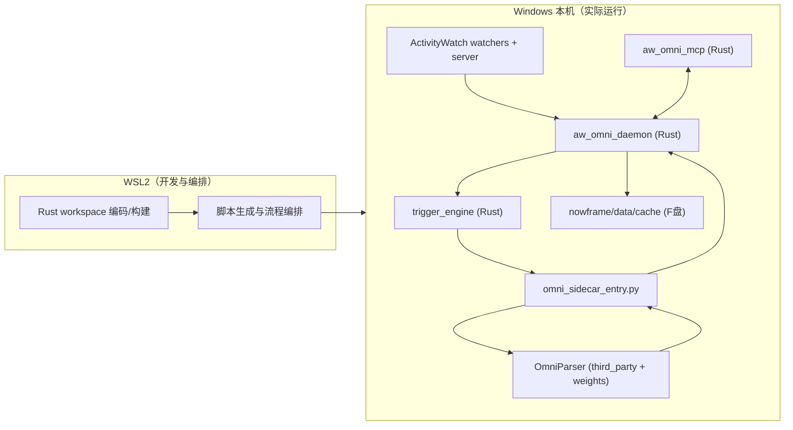
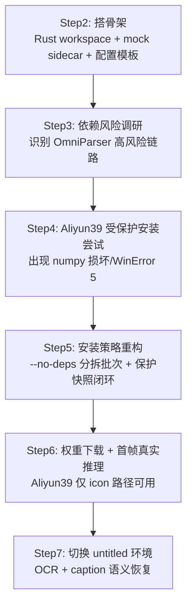
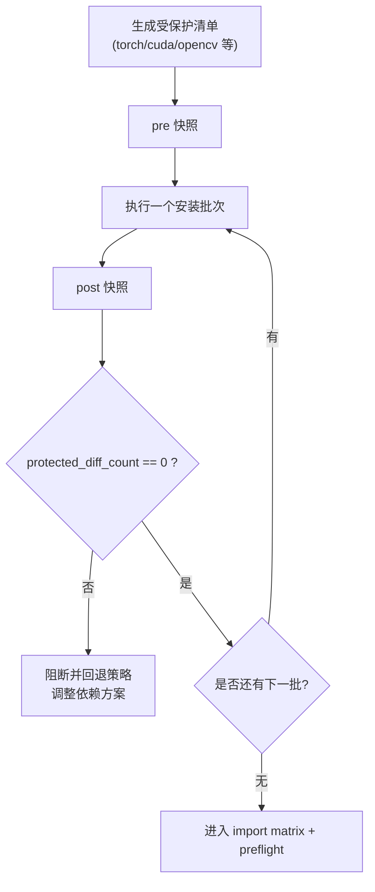
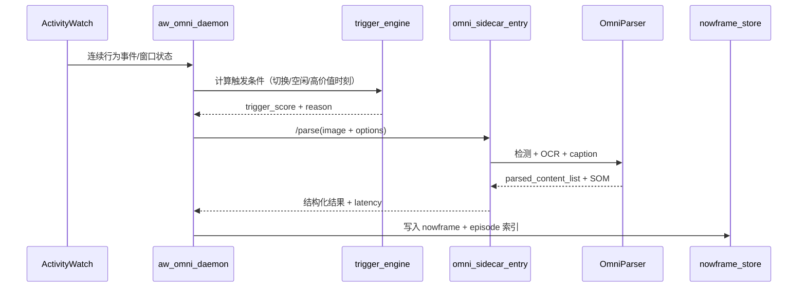

# codex_001_omniSidecar：OmniParser Sidecar 从 0 到可用全流程复盘

> 目标：把这次 `AW + OmniParser + Rust MCP` 的落地过程完整沉淀下来，覆盖环境、步骤、坑点、修复策略、验证结果与后续建议。  
> 机器背景：Surface Book2（i7 / 16G / GTX1060），Windows 为实际运行主机，WSL2 主要用于编码与编排。

---

## 1. 最终结果先看（TL;DR）

本轮已经达到“可用 + 可维护 + 可复现”的阶段：

- 已完成 Rust 控制面 + Python sidecar 的一体化基础骨架。
- 已完成 OmniParser 权重下载与真实首帧推理验证。
- 已实现两套运行模式：
  - `real_local_aliyun39`（兼容旧栈，语义能力受限）
  - `real_local_untitled`（OCR + caption 语义完整）
- 关键保护目标达成：多轮安装后 `protected_diff_count = 0`（受保护包未被破坏）。
- `untitled` 环境下 preflight 成功：`ready=true`、`missing_imports=[]`、`missing_weights=[]`。
- 真实首帧语义结果（untitled）：
  - `has_text=true`
  - `has_icon=true`
  - `caption_status=present`
  - `elements=52`
  - `latency_ms=61245`，`latency_ms_wall=91062.93`

---

## 2. 初始约束与工程边界（决定成败的前提）

## 2.1 硬件与空间约束

- 本机核心运行在 Windows，AW 也在 Windows 路线运行。
- 盘符容量紧张：
  - `F:` 可用空间有限（约 11~12G），但必须承载缓存与模型。
  - `D:` 基本接近满盘，不适合继续堆缓存/模型。
- 策略：代码可临时在 `/tmp` 编译，再同步到 `F:`；所有重缓存、模型、日志尽量落 `F:\aw-omni\...`。

## 2.2 Python/GPU 约束

你明确提出了核心保护原则：

- 优先复用既有 CUDA/PyTorch 环境，避免重装驱动链。
- **禁止破坏既有关键包组合**（尤其 torch/cuda/opencv）。
- 安装新包必须可控、可追踪，必要时先做元数据评估，再分批推进。

## 2.3 为什么必须做“受保护安装”

OmniParser 依赖链复杂（推理 + OCR + caption + 检测），一旦直接 `pip install -U`，极容易触发：

- `torch` 版本漂移
- `opencv` 被 headless 版本顶替
- `numpy` 不兼容或损坏
- CUDA 可用性异常

所以采用了“快照 + 约束 + 批次 + 差异闸门”的安装治理方式。

---

## 3. 总体架构（最终形态）



核心思路：

- AW 负责持续行为时序。
- Rust daemon 负责触发、调度、合并与落盘。
- OmniParser sidecar 只在触发时运行推理，不做无意义常驻高频解析。
- MCP 暴露统一接口给上层智能体/节点图。

---

## 4. 目录与产物布局（这套结构为什么稳）

核心目录按“运行资产”和“源码资产”拆分：

```text
F:\aw-omni\
  src\                     # Rust workspace + sidecar + scripts + docs
  runtime\
    logs\
    pid\
  data\
    aw_raw\
    episodes\
    nowframes\
  cache\
    screens\
    thumbs\
    tmp\
    paddlex\              # 后续显式重定向
  models\
    omniparser\           # 权重集中
  release\
```

这样做的价值：

- F 盘可统一治理空间占用。
- 便于清理：模型、缓存、日志分层独立。
- 便于迁移：把 `src` 和 `models` 带走即可快速重建。

---

## 5. 分阶段实施复盘（Step2 ~ Step7）

## 5.1 阶段时间线（逻辑线）



## 5.2 各阶段关键动作与结果

| 阶段 | 关键动作 | 结果 |
| --- | --- | --- |
| Step2 | 初始化 Rust workspace、mock sidecar、运行脚本、`local.wsl.toml/local.win.toml` | `cargo check` 通过；health/build-nowframe 基础联通 |
| Step3 | OmniParser 依赖风险分析，产出风险报告 | 判定直接安装风险高，需受保护安装策略 |
| Step4 | 在 Aliyun39 做 guarded 安装；处理 numpy 异常 | 修复后受保护包差异仍 0；但 batch2 被 `opencv-python-headless` 依赖链阻断 |
| Step5 | 重写安装策略：分批 + `--no-deps` + import matrix + preflight | U 类批次安装可控，核心链路可跑 |
| Step6 | 下载真实权重（约 1.05GB）、首帧 parse、本地补丁 | Aliyun39 首帧成功但无 OCR/caption（仅 icon） |
| Step7 | 引入 untitled 环境，保持保护约束并补齐依赖 | preflight `ready=true`；首帧 `has_text=true` + caption present |

---

## 6. “受保护安装”机制（这次最关键的方法论）

## 6.1 流程图



## 6.2 核心脚本职责

- `scripts/protect_snapshot_win.ps1`  
  记录安装前后关键包快照，用于计算 `protected_diff_count`。

- `scripts/build_protected_constraints.py` / `scripts/build_untitled_constraints.py`  
  基于当前环境生成约束文件，避免安装过程误升级关键栈。

- `scripts/install_aliyun39_guarded_win.ps1` / `scripts/install_untitled_guarded_win.ps1`  
  分批安装，逐批校验差异闸门。

- `scripts/check_import_matrix_win.ps1`  
  快速做“可导入矩阵”验证，尽早发现链路断点。

- `scripts/check_omni_preflight_win.ps1`  
  运行前置检查（imports/weights/ready 标志）。

---

## 7. 这次踩过的坑（按影响度排序）

## 7.1 坑 1：`numpy` 损坏 + `WinError 5`

现象：

- `ImportError: cannot import name 'set_module' from numpy._utils`
- 期间出现 Windows 文件访问拒绝（`WinError 5`）

处理：

- 强制重装 `numpy==1.26.4`
- 关闭占用进程后重试
- 用 pre/post 快照确认受保护包未连带变化

经验：

- Python 环境损坏时，先修基础科学栈，再推进模型依赖。
- 先验证 `import numpy`，再谈后续推理链路。

## 7.2 坑 2：`supervision` 牵出 `opencv-python-headless`

现象：

- batch2 被阻断，因为依赖链会动到受保护 `opencv`。

处理：

- 改为分拆安装策略，针对特定包使用 `--no-deps`，把依赖控制权收回到脚本。

经验：

- 在受保护环境里，不能把决策权完全交给 pip 的自动解析。

## 7.3 坑 3：Aliyun39 上 OCR/caption 语义缺失

现象（Step6）：

- `ok=true`，但 `has_text=false`、`has_icon=true`。
- 原因是旧 torch 栈与 EasyOCR/Florence2 组合兼容性不理想，最终只跑通 icon 路径。

处理：

- 不强行污染 Aliyun39，转向已具备 CUDA 能力的 `untitled` 环境。

经验：

- “能跑”不等于“语义完整可用”，必须以 `has_text + caption` 为验收指标之一。

## 7.4 坑 4：缓存默认写入 C 盘

现象：

- Paddle 相关初始化尝试写入 `C:\Users\surface\.paddlex`。

处理：

- 在 sidecar 入口设置 `PADDLE_PDX_CACHE_HOME=F:\aw-omni\cache\paddlex`。

经验：

- 模型框架常有隐式缓存目录，必须在入口统一重定向。

## 7.5 坑 5：`pip` 版本能力限制

现象：

- `pip 20.0.2` 不支持 `--dry-run`，导致传统干跑不可用。

处理：

- 用“元数据调研 + 分批安装 + 快照差异闸门”替代纯 dry-run。

经验：

- 工程上要准备“降级方案”，不能把流程绑死在某个新参数上。

---

## 8. Aliyun39 与 untitled 的分工结论

| 环境 | 角色 | 状态 |
| --- | --- | --- |
| Aliyun39 | 既有稳定环境，保守复用 | 可跑基础链路；首帧仅 icon，OCR/caption 不完整 |
| untitled | 语义增强环境（推荐 sidecar 运行） | 预检通过，OCR + caption 可用 |

结论：

- **生产建议：sidecar 默认切到 `real_local_untitled`。**
- Aliyun39 保留为兼容/回退路径，不再强行承担完整语义任务。

---

## 9. 关键验证证据（验收要点）

## 9.1 Step6（Aliyun39）首帧

- 权重下载：5 个文件，总计 `1,124,548,517` bytes（约 1.05 GB）。
- parse：`ok=true`，`elements=49`，`latency=7312ms`（wall `9579.62ms`）。
- 语义：`has_text=false`，`has_icon=true`。
- 受保护差异：`protected_diff_count=0`。

## 9.2 Step7（untitled）首帧

- U1/U2/U3/U4 批次安装全部 OK。
- `protected_diff_count=0`（pre vs post）。
- preflight：`probe_ok=true`，`ready=true`，`missing_imports=[]`，`missing_weights=[]`。
- parse：
  - `elements=52`
  - `has_text=true`
  - `has_icon=true`
  - `caption_status=present`
  - `latency_ms=61245`，`latency_ms_wall=91062.93`

---

## 10. 运行链路（从 AW 到 nowframe）



触发策略建议：

- 默认低频（如 10~30 秒窗口 + 事件触发）。
- 突发场景加权（窗口切换、长驻页面、学习状态）触发高质量 parse。

---

## 11. 可直接执行的关键命令（当前可用）

> 以下为已验证命令范式（Windows 路径）。

```powershell
# 1) 受保护安装（untitled）
powershell.exe -NoProfile -ExecutionPolicy Bypass -File F:\aw-omni\src\scripts\install_untitled_guarded_win.ps1

# 2) 启动真实 sidecar（untitled）
D:\exe\environment\anaconda\envs\untitled\python.exe F:\aw-omni\src\sidecar\omni_sidecar_entry.py --mode real_local_untitled --host 127.0.0.1 --port 8000 --real-repo F:\aw-omni\src\third_party\OmniParser --weights-root F:\aw-omni\models\omniparser

# 3) 首帧真实 parse 验证
powershell.exe -NoProfile -ExecutionPolicy Bypass -File F:\aw-omni\src\scripts\run_first_real_parse_win.ps1 -Python D:\exe\environment\anaconda\envs\untitled\python.exe -Mode real_local_untitled -OutPath F:\aw-omni\src\docs\step7_untitled_first_parse.json
```

---

## 12. 本次工程方法的可复用模板

可以复用到未来任何“高风险 AI 依赖落地”场景：

1. 先做目录与缓存策略，避免“边跑边爆盘”。
2. 先搭 mock 联通系统骨架，再接真实模型。
3. 采用“受保护安装”治理依赖漂移。
4. 每批安装都做快照对比，不合格立即阻断。
5. 先追求“可用闭环”，再逐步追求“语义完整”。
6. 用 preflight + 首帧基准作为验收，而不是“脚本跑完就算成功”。

---

## 13. 下一阶段建议（安装阶段已可收官）

当前 OmniParser sidecar 安装与可用性验证已达到阶段目标，后续建议转向“系统稳定性与产品化”：

- 把 daemon 触发链正式切到 `real_local_untitled`（低频采样起步）。
- 建立运行时指标：触发频率、GPU 占用、平均 latency、失败重试率。
- nowframe 增加语义压缩层（用于后续 MCP/节点图检索）。
- 制定缓存淘汰策略（按天/按大小双阈值）。
- 将“受保护安装 + preflight + 首帧验证”封装为一键健康检查命令。

---

## 14. 一句话结论

这次最重要的不是“把 OmniParser 装上”，而是建立了**可控、可审计、可迁移**的工程化路径：  
在不破坏既有关键环境的前提下，把桌面理解从“能跑”推进到“有语义可用”。
