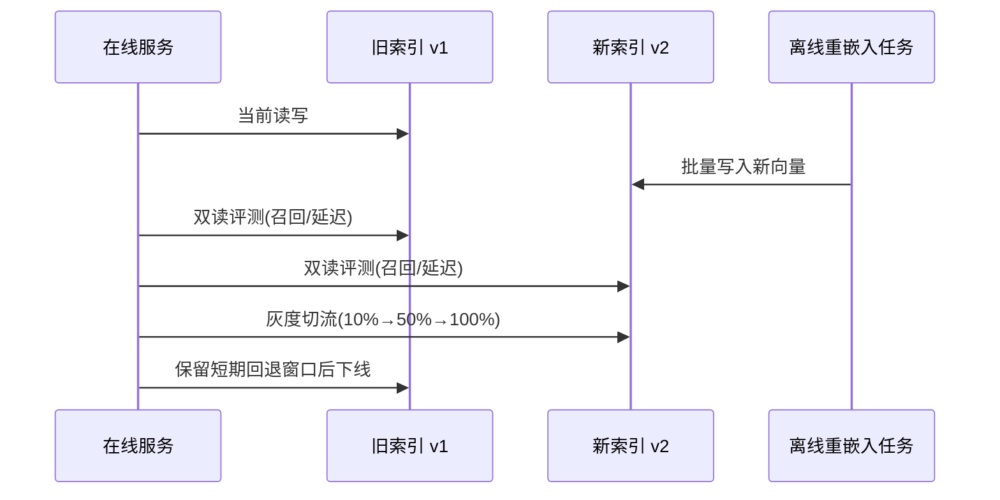
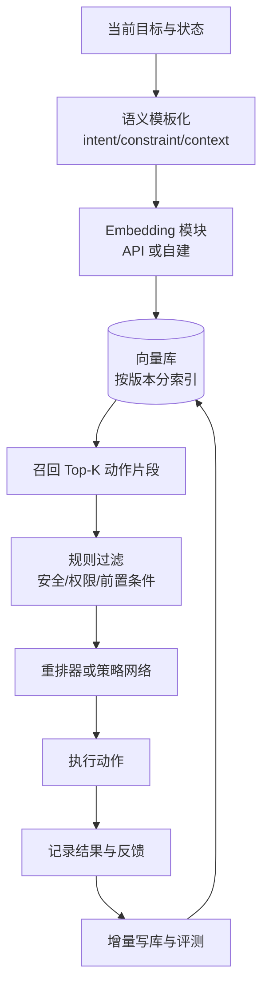

# Embedding、隐空间与视觉-语言-动作对齐（中文整理）

> 目标：把我们前面讨论的 embedding、动作、视觉、语言对齐，以及和世界模型（`h`/`z`）的关系，整理成一份可直接落地的中文笔记。

## 1. 先统一概念（避免名词混用）

- **Token Embedding（词/子词嵌入）**：模型内部查表向量，属于参数的一部分。
- **Text Embedding（文本嵌入）**：API 输出的“整段文本向量”，用于检索、聚类、匹配。
- **`h_t`（隐状态）**：时序工作记忆，承载“当前上下文 + 过程信息”。
- **`z_t`（潜变量）**：压缩后的抽象表示，常用于生成与动力学建模。
- **Action Embedding / `z_act`**：动作片段（轨迹、技能、控制意图）的紧凑表示。

一句话：**词嵌入只是 latent space 的一个局部，`h/z` 与动作潜变量才是“行为智能”核心。**

## 2. “是不是统一向量空间？”

- 不是全行业统一空间，而是**模型私有坐标系**。
- 同一模型、同一维度、同一预处理下，向量可直接比较。
- 跨模型向量通常不能直接混算（即使维度一样也不等价）。
- 工程上不要幻想“天然统一”，要做**可学习对齐层（projector）**。

## 3. Embedding 库如何维护（RAG/动作检索通用）

### 3.1 必要元数据

每条向量至少携带：

- `embedding_model`
- `dimensions`
- `embedding_version`
- `preprocess_version`
- `created_at`
- `source_id` / `chunk_id`

### 3.2 存储与索引策略

- 新旧模型向量**分索引**（例如 `actions_v1`、`actions_v2`），禁止混放。
- 保留 `raw_text/raw_action`，不要只存向量。
- 向量召回后再做规则过滤（权限、前置条件、安全约束）。

### 3.3 迁移与重嵌入

- 技术难度中等，核心是离线批处理 + 灰度切流。
- 成本估算：`cost = total_tokens / 1e6 * unit_price`。
- 时间估算：`time = total_items / throughput(items/s)`。
- 推荐流程：新建索引 -> 批量重嵌入 -> 双读评测 -> 灰度切换 -> 下线旧索引。

## 4. 词嵌入、隐空间、世界模型的关系

### 4.1 典型三层架构（推荐）

- **`z_sem` 语义层**：对齐视觉/语言/动作的“可比语义”。
- **`h_dyn` 动力学层**：建模状态转移与时间依赖。
- **`z_act` 技能层**：表示可执行动作、动作模板、技能先验。

关键点：**不要强求单一“大一统向量”；分层 + 对齐通常更稳。**

### 4.2 训练目标（示意）

可写成：

`L = L_align + λL_dyn + βL_act + γL_retrieval`

- `L_align`：跨模态对齐（如对比学习）。
- `L_dyn`：世界动态一致性（预测/重构/时序约束）。
- `L_act`：动作可执行性与平滑性。
- `L_retrieval`：检索质量与任务相关性。

## 5. 先从“动作嵌入”切入是否可行？

**可行，而且通常是最稳入口。**

建议顺序：

1. 先做 `action -> z_act -> action`（先保证可逆和可执行）。
2. 再做 `text/image -> projector -> z_act`（跨模态对齐）。
3. 最后接策略头与世界模型（闭环控制）。

这样比一上来追求“全模态统一黑盒向量”更易迭代、更好诊断。

## 6. 最小可行系统（MVP）

### 阶段 A（2~4 周）：动作嵌入闭环

- 定义动作片段 schema：状态、动作、约束、结果。
- 训练动作编码器/解码器（AE/VQ/离散 token 皆可）。
- 指标：重建误差、动作平滑性、可执行成功率。

### 阶段 B（4~8 周）：跨模态对齐

- 语言/视觉编码后投影到 `z_act`。
- 做动作检索与重排（先离线，后在线）。
- 指标：Recall@K、NDCG、任务成功率提升。

### 阶段 C（8+ 周）：世界模型融合

- 加入 `h_dyn` 预测与规划。
- 对比“仅检索”与“检索+世界模型”的长期任务表现。

## 7. 研究现状（你关心的问题的直接结论）

- 社区已有大量“局部解”：VLA、latent action、跨本体对齐、世界模型融合。
- 但公开范式里，尚未看到一个绝对统一且工程上普适的终局方案。
- 当前主流共识是：**动作潜变量先行 + 跨模态对齐 + 分层融合**。

## 8. Mermaid 图（GitHub 可渲染）

### 8.1 总体分层与对齐关系

```mermaid
flowchart LR
    subgraph M[多模态输入]
      V[视觉观测 v_t]
      L[语言指令 l_t]
      A[动作轨迹 a_t]
    end

    V --> EV[视觉编码器 E_v]
    L --> EL[语言编码器 E_l]
    A --> EA[动作编码器 E_a]

    EV --> ZSEM[z_sem 共享语义层]
    EL --> ZSEM
    EA --> ZACT[z_act 动作技能层]

    ZSEM -- 对齐损失 --> ZACT
    V --> HDYN[h_dyn 动力学层]
    A --> HDYN

    ZACT --> PI[策略头 π(a|s)]
    HDYN --> PLAN[预测/规划]
    PLAN --> PI
```

### 8.2 Embedding 重嵌入迁移流程



### 8.3 Action-RAG 到执行闭环



## 9. 实操原则（避免踩坑）

- 不混用不同模型的向量索引。
- 永远保留原始可重算数据（文本/动作/上下文）。
- 检索系统做版本化与灰度切流，不做一次性硬切。
- 对齐层单独可替换，给未来换模型留接口。
- 评测必须看“任务成功率”，不仅看向量相似度。

## 10. 可继续阅读（高相关）

- OpenAI Embeddings 指南：<https://platform.openai.com/docs/guides/embeddings>
- RT-2：<https://arxiv.org/abs/2307.15818>
- Open X-Embodiment / RT-X：<https://arxiv.org/abs/2310.08864>
- OpenVLA：<https://arxiv.org/abs/2406.09246>
- Octo：<https://arxiv.org/abs/2405.12213>

---

如果后续你要把这份文档变成“可执行路线图”，可在此基础上再补三块：

1. 数据字段与切片规范（JSON schema）。
2. 训练配置模板（损失权重与 ablation 表）。
3. 线上评测看板定义（召回、成功率、稳定性、成本）。
